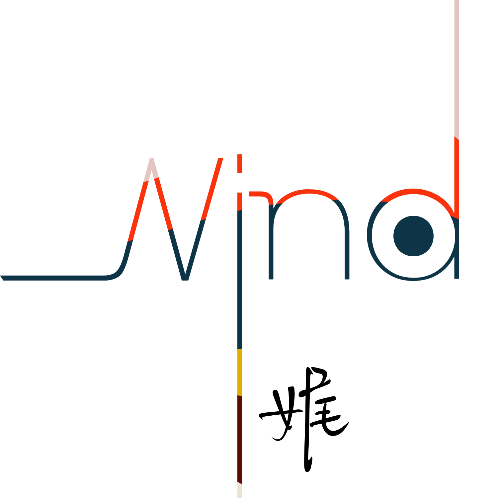

* [WHO IS LEA](whoislea)

* Soft Whisper
  * [汤匙里的满月](汤匙里的满月.md)
  * [遇见久歌](遇见久歌.md)
  * [半步秋春夏未冬](半步秋春夏未冬.md)
  * [又闻故人歌](又闻故人歌.md)
  * [羊毛与花](羊毛与花.md)
  * [“如何是好”又如何是“好”？](如何是好.md)
  * [最是独景，惹嫣然](独景惹嫣然.md)
  * [楼上的猫小姐](楼上的猫小姐.md)
  * [姐姐的触角](姐姐的触角.md)
  * [班机不飞西雅图](班机不飞西雅图.md)
  * [欢梦易逝，近景尤奢](欢梦易逝，近景尤奢.md)

* Deep Breathe
  * [第三次看见](第三次看见.md)
  * [远山的泣歌](远山的泣歌.md)
  * [樱瓣儿飞扬](樱瓣儿飞扬.md)

* 在途
  * 在读
  * 在想
    * [千寻与辛巴：你我曾拥有的“成长”（上）](千寻与辛巴1.md)
    * [千寻与辛巴：你我曾拥有的“成长”（下）](千寻与辛巴2.md)
    * [落红无声，已入秋：总要有些东西，在温暖渐远的时候来弥补。](落红无声，已入秋：总要有些东西，在温暖渐远的时候来弥补。.md)
    * [在冷透的思念里浸泡，直至日出时醒来](在冷透的思念里浸泡，直至日出时醒来.md)
  * 在听
* [词汇表](_glossary.md)