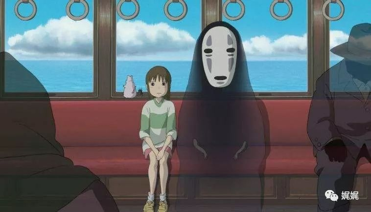
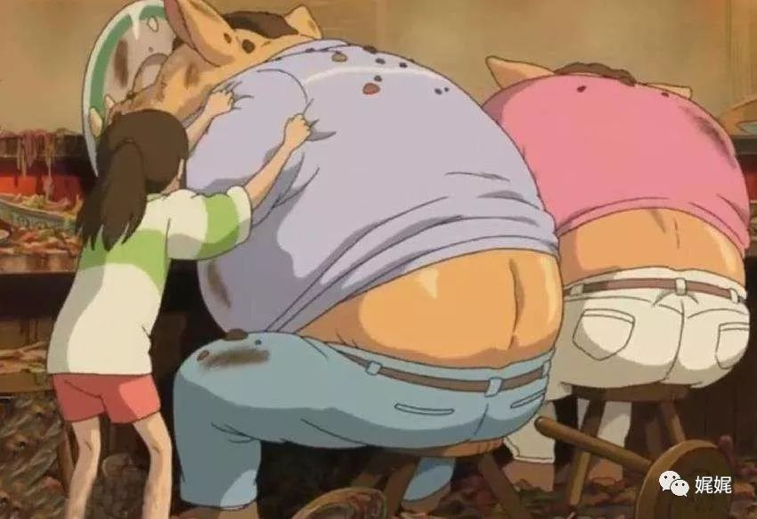
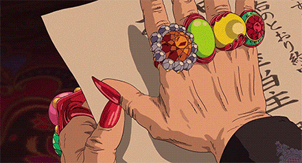

# 千寻与辛巴：你我曾拥有的“成长”（上）

6月的时候，《千与千寻》重映了，我泣不成声。

7月的时候，《狮子王》3D版上映了，我哭成败犬。

荧幕上的千寻和辛巴在奔跑中，冲破了蒙眼的谎言，挣脱束缚自己的“恐惧”，破茧成蝶。无论是家的方向，还是星空的边缘。在变幻万千的世界里，他们找到了一处“定点”，不曾偏移。脱去稚嫩的自己，换上成人的视角再次观看。看到的是别人的坚守，和一地破碎的自己。

本期清单

《千与千寻》

《狮子王》

---

### **《千与千寻》一场如梦的成人礼**

------

##### Sunday 10:00 am.

年少不懂事，觊觎成人世界的“标志”，爱情。那时候觉得，一日三餐、读书学习之外，成人世界于我们最诱人的苹果便是与人相爱。所以，愚蠢至极的将《千与千寻》当作一部爱情片来看，满心满眼都在念着小白。把整部电影当作一部少女爱情奇遇记，各路鬼怪和磨难不过是恰到好处的助攻。男主白龙、女主千寻还有痴情备胎无脸男，滥俗剧集的必备要素一应俱全。

然而，成年后的自己，在这部电影里窥见了浮生百态。

无意间发现的悠长通道，似是神庙或教堂的宽敞建筑，无尽起伏的草浪和引人贪食的丰盛美食。千寻像是被神明抽签选择的孩子，参加了一场类似试炼的成人礼。

在这场试炼里，人性最底层的欲望不断被刺激，被撼动的人丢掉姓名、自我，成为任人宰割的躯壳。然而，在这场灯红酒绿的浮华中滋润过活的人，能做的不过是藏好软肋、守住脆弱、粉饰肮脏，才能够自欺欺人的继续享乐。

挣扎过后放弃抵抗的锅炉爷爷和小玲，贪念迷眼如傀儡一般的一众小怪，失心堕落的千寻父母、寻求归宿和认可的无脸男，藏着巨婴的汤婆婆和阅尽浮华后回归内心的钱婆婆。

他们有人疼爱千寻，是因为千寻做了他们想做却无法做到的事情；他们有人憎恶千寻，也是因为千寻要捅破他们精心编织的美梦。千寻，是一面镜子，照得到他们的渴望、也照的出他们的梦魇。

电影中有几处地方让我印象深刻，反复咀嚼之后觉得很有深意。（纯属个人思考，也许过分解读）

### **1.渴望“有用”的无脸男**

初看电影的我，把无脸男的照顾都当做了殷情，笃定他是因为爱慕千寻才这般、那般。可是重映的几个细节让我似乎理解到他内心真实的渴望，他渴望被人认可、渴望融入、渴望成为一个有用之人。

首先是汤婆婆给异世界定下的规矩：“有工作的人才可以留下来。”因此，“是否有用”是衡量这里生存之人的一大标准，因而所有的鬼怪都想方设法的让自己忙碌起来以证明自己“有价值”。然而，无脸怪四处飘荡没有形体，只有一面面具，似笑非笑。看起来，很虚假也很空虚。也许很长一段时间，他独自的来往，没有人留意过他。

> 東宝オフィシャルサイト *| 无脸男与千寻*

然而，在桥上奔跑的千寻为他停下来，无脸男也在同时注意到了她。而后她在浴场外看见无脸男，也给他留了门。这样的“注意”，也是一种认可，认可他是存在的。

于是，无脸男想要用自己的方式向千寻证明他可以做更多，于是他为千寻偷来药浴牌子、给千寻很多很多的金子。同样的，他用这样的方式在浴场获得了原本他想要的那种“存在感”—被人众心捧月。然而，在这之间他逐渐迷失在这一片的虚妄之中，而千寻的拒绝和帮助让他认识到自己所获得的并非真正的“价值”。

所以，当他在钱婆婆那里帮着织毛线、得到钱婆婆的赞扬和挽留的时候。他才真正得到救赎、得以存在。

他先前那么渴望被关注、渴望获得声音、渴望被众人簇拥，最终才发现：物化的盛大是假，内心的富足才是真。

### **2.成人世界的子女教育与自我教育**

电影中有两组“父母与孩子”，千寻与爸妈，汤婆婆与巨婴。

昨日的孩童，就是今日的父母。其实所谓“成人世界的子女教育与自我教育”不过就是同一人在身份角色转变后对自己实施的教育的转变。

初次看《千与千寻》的时候，在片头父母和千寻进到秘境那段，对我而言是有些惊悚的。我不能理解面对这样一个意外之地，成年的父母为何如此没有心防的坚持前进，甚至要拉上孩子。再次看的时候，不说鬼神诱惑一类的设定，单从父母的行为和对话，是能嗅出点端倪来的。我从千寻父母、汤婆婆身上看到了成年人被这个世界“拔苗助长”的疼痛。

在走近隧道前，母亲起初是犹豫的，但是耐不住象征“权威”的父亲诱导，于是母亲拖拽着女儿一同前往。而后他们通过相互鼓励和认可，都没去过多关注周遭的异常，并在诡异的无人城镇上大吃特吃起来。整个过程，连孩子都看得出来的诡异、异常，两位成人父母却并未疑虑和退缩。

这个过程似乎就是成人的子女教育和自我教育。

> 東宝オフィシャルサイト *| 千寻父母*

也许起初，他们各自心中都是疑窦丛生的。但身为家主的父亲不想表现出退缩，而温顺的母亲不想表现出不信任，同时这对年轻的父母都想要向孩子证明“没什么可值得担心的”。

因此在这些心理的推动下，他们马不停蹄的行动着，没有时间去怀疑、思考。成人在教育子女之前，也在教育自己“何为父母”。

然而，“拔苗助长”的结果是，他们在强撑的“强大”之下，终究还是人。欲望这件事，也许与年龄无关。面对食欲，千寻的警觉和父母的来者不拒形成了鲜明的对比。而在这个过程中，他们比孩子更先忘掉了自己的姓名，忘记了自己为人。

再看汤婆婆和她百般疼爱的巨婴。故事的前半段，巨婴宝宝是被汤婆婆用谎言和华丽藏起来的的。身型庞大的它、身着肚兜，照搬着“外面世界很危险”的谎话。这样的形象和那三颗上了年岁的脑袋一样讽刺。而后半段，钱婆婆将它们变成“渺小”的生物，也让他们跟着千寻见识到了真正的世界。经过历练的宝宝在回来之后，反身给汤婆婆上了一堂课。

无疑，汤婆婆表现出的是另一类成人父母的焦虑。他们在现实世界看到了一些肮脏与无奈，甚至与之同流合污。但他们希望自己在孩子眼中仍旧是完美的，也希望孩子不要受到他们受过的苦难。因此他们过度保护、他们粉饰真相。因为他们不相信，孩子可以理解、能够生存。

然而，世界再一次让这位成人见证了自己失败的子女教育，也再一次让她完成了一次自我教育。孩子见到她见过的世界，丢掉了她给予的保护，回归时却成长的内心强大。

同样的，《千与千寻》电影本身也兼具了子女教育和成人自我教育的两大意义，观者永远不该仅是孩子。

### **3.姓名的意义**

> 東宝オフィシャルサイト *| 汤婆婆拿取人的姓名*

电影中还有一个设定让我觉得很有意思，那就是“拿取姓名”。平常生活里，姓名是一个代号、标签、记号，用来区分芸芸众生中的你我他，而称呼、称谓又给无数的你我他之间附上了或亲或疏的关系链。

其实很多电影里，定义“剥夺一个人”的做法各式各样，剥夺记忆、剥夺财富、剥夺你在别人记忆里存在的片段。想让一个人痛苦，感觉到被威胁、感觉到无能为力，就得拿走一些对他而言意义重大，且他无法很快找补回来的东西。

而电影选择了“姓名”，就很奇妙。

现代生活中大家都不喜欢记全名了，昵称满天飞。甚至法律上认可的也是证件上唯一的身份编码，以避免重名带来的识别尴尬。

那么，“姓名”就不值一提了吗？姓名本身并非一个标记那么简单，它代表着一种“根”的文化。姓代表家族，名代表个人，合起来就代表着你所在的根系、你所处的位置。就像坐标一样，姓名从传统来说就是你身份的坐标。坐标没有了，就相当于你在这个世界上存在的痕迹被抹去了。在东方人的内心深处，人不能独活、需要有家。拿去姓名，就是被剥夺了归属、身份甚至是灵魂，从此边居无定所、如同行尸。

因此，电影里小白对千寻说：记住姓名，才能找到回家的路。

而对于在忙碌世俗中奔波的我们，能呼唤我们姓名的人，何尝不是那个在身后拉扯我们摆脱迷失的人呢？

