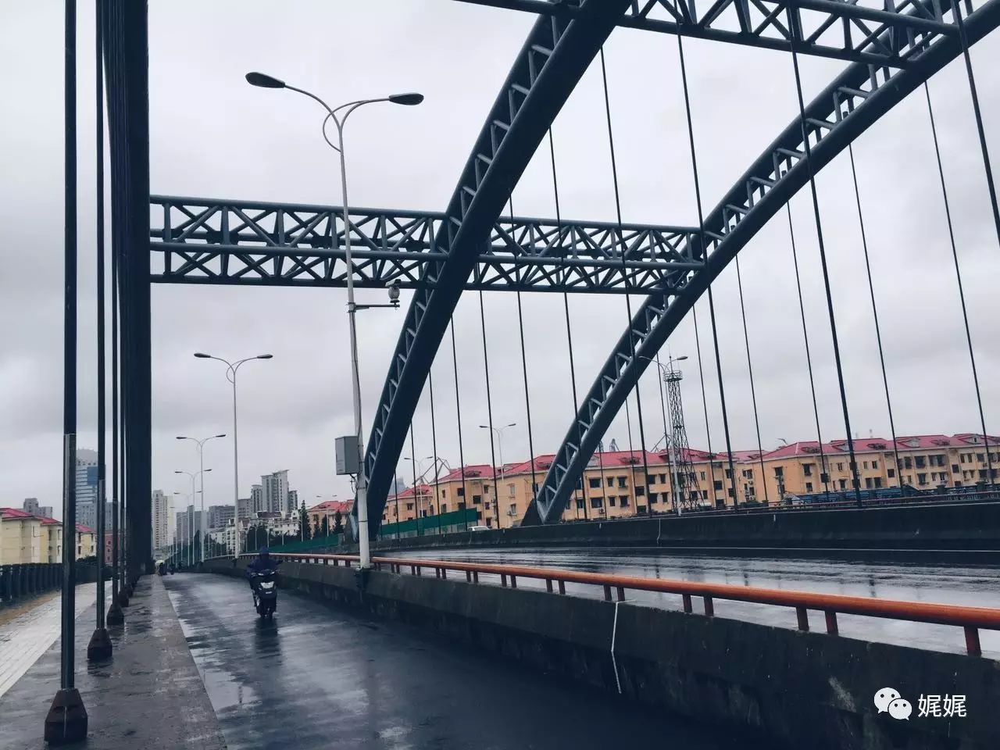

#  姐姐的触角

### **［一］**

那是在很小的时候，小莫南软趴趴的小身子，圆滚滚的团在碎花床单上。藕节一样白花花的小胳膊坠在圆圆的身子两侧，嘟着小嘴，歪着头看着屋子里的其他人。

一身浅灰色的棉布睡衣，发髻松散，身形瘦小。

除了小莫南，坐在屋子中间的是姐姐莫离。小身板儿一颤一颤的，背对着莫南，坐在地上。

没有说话，小姑娘只是愣愣的抬起右手，伸开小小的手掌，向着姐姐的方向。突然，莫离停止了动作，但还是背着身子。房间里，微微开启的窗，有和煦的光从半指宽的缝中投进屋子里，不偏不倚的落在莫离卧坐的身形前。那是怎样明媚温暖的一个下午，房间里的摆设统统都是暖色调的模样，就连窗边矮桌上的白瓷花瓶里，那支已然萎蔫的鹅黄色玫瑰，都似是有了抬头的样子。那两面嫩绿色缀红花黄点的麻布窗帘是母亲挑选的。莫南汪汪的眼眸呆呆地定在窗户的方向，咿咿呀呀的嘟囔着。

声响中，莫离抬头看了看窗外，然后缓缓的转过头。

那是一抹明亮的笑，嘴角扯动的厉害，眼窝中却像兜满了水汽。

那一天之后，这样的笑，就常常出现在姐姐削瘦的脸上。

### **［二］**

“小南乖，姐姐抱抱你。”姐姐太瘦了，所以倘若妈妈和姐姐都坐在身边，小莫南是绝不会将手伸向姐姐的。可是此刻，小莫南却不吭不响的把两段小藕节乖巧的张开来，然后软软的环住姐姐的脖颈。下巴刚刚落在姐姐消瘦的肩上，随之而来的便是后背上濡湿的暖意。

第二天的太阳照常的挂在了浅蓝色的天空上，摇摇摆摆的将金沙般的阳光挥洒出去，星星点点的落满一地。嫩绿色缀红花黄点的落地麻布窗帘依旧在时针敲中“8”字的时候被一下子拉开，小莫南就这样被明晃晃的弄皱了眉头。当她用小手胡噜着双眼，慢慢睁开的时候，映入眼帘的就是这样一脸明媚的姐姐，嘴角扯成那样夸张的弧度，露出一口被牙套箍的歪七扭八的白牙，眼角弯弯。

是触角，那时候小莫南就觉得姐姐那张像极了面具的脸后，有什么东西软软柔柔的伸过来，拉扯住她的脸颊、眼角、耳朵，不疼不痒却古怪别扭。就那样，小莫南哭了，而后的某天，她终于找到了合适的词汇来形容那样东西——姐姐的触角。

“总是这样啊，就这么不知不觉的伸过来，扰得我害怕。”在那之后，姐姐只要一戴上那样的面容，触角就会跑出来，吓得莫南哇哇大哭。

也不知道什么时候，莫南的三餐从精致的三样菜，变成了黑乎乎的焦灼菜团。也不知道从什么时候起，拉开那两片嫩绿色缀红花黄点的麻布窗帘的人，变成了不及半窗高的姐姐。也不知道从什么时候起，姐姐的触角如影随形。

“莫南，吃饭的时候多嚼一会。不许这么没规没矩的乱动。”说这话的时候，姐姐仍旧低眉，看着手边的事情。她正笨拙的用筷子扒拉着鱼肉里的刺，然后裹进嘴里试过，又有模有样的放进莫南的碗里。奇怪的是，莫南总是乖巧的吃完。

很快，自打莫南上学后，晚上的时光里，家里总是安静的。这时候，莫离已经搬离了莫南的房间，住进父母曾经的睡房。所以放学后，姐妹俩总是各自在房间里温习功课。

“莫南，不要看小说了，快点写完作业就去睡觉，听见没有。”然后，莫南的房间里就是一阵手忙脚乱的窸窣声。莫南想，一定是姐姐的触角，弯弯绕绕的伸进房间里来看。她翻动着手中的《蔓蔓青萝》，撇撇嘴，乖乖的把书塞进了桌底。

姐姐，一定有触角，即使没戴面具的时候。每天睡着前，莫南都如是的想着，然后嘟着嘴沉沉的睡去。

### **［三］**

之后的两三年里，姐姐和莫南安然地度过。小学、初中、高中，今年的初秋，莫南就要离开这座熟悉的南方小城，独自一人去北方读大学了。

“姐姐的触角没那么长，怎么办呀。”莫南撇撇嘴，坐在床上磨磨蹭蹭的收拾着东西。

离床不远的地板上，姐姐盘腿坐着，利落的翻折着熨烫好的衬衣。听见声响，回头疑惑的看着莫南，示意她重复刚才嘟囔着的话。

看着姐姐仍旧白皙消瘦的面容，微皱的额头，盘在脑后松散的发髻和挂在耳边的几缕碎发。不上妆的姐姐，面色总是有些灰黄，此时的嘴角却牵扯不出一丝的弧度。

姐姐的面具，从很久之前就不再戴了，那么触角呢，也许很久之前就没有了吧。触角和面具，再也没有出现过。

门边的金色光辉里，不知道何时迎来了一个挺拔的男子，高高瘦瘦的，正用一只手缓缓的推动鼻梁上的金丝框眼镜。莫南将目光移向男子，不经眯起了眼。无名指上的那抹反光，亮闪闪的，却不及男子唇角柔柔的笑。

莫南盯着那双薄唇开开合合，听不清男子说了什么，只看见姐姐突然面色柔和的回过头去，欢喜的站起来走向他。

莫南捕捉到那丝动容的笑，没有夸张的弧度，没有兜着水汽的眼角，没有灰败的面色。柔软而温暖，鹅黄色的底掺着星点的酒红色，晕染开来，在姐姐转头的那一瞬，划出了一道美好的光亮。

触角与面具，被姐姐埋进了过去里。而曾经胆寒它们的莫南，此刻却如此的怀念。

### **［尾］**

缓缓移动的车厢壁上，镶着一面面透亮的玻璃窗。姐姐用手捂住了半张脸，眼角中兜满了晶莹的水光。车没开动时，她已背过身去，倚靠在男子的怀里。车窗缓缓的踩着节拍，向前踱着，时光却好似上了发条般飞速的向回跑着，姐姐依然瘦小的小身板儿，一颤一颤的，发髻松散，那身浅蓝色荷叶边的连衣裙似乎也变成那身灰色的棉布衣裳。然而，没有了嫩绿色缀红花黄点的麻布落地窗帘，此刻浮动翻开的，似是一面枯黄的书页，一张、两张，渐渐再看不见那样的姐姐、她的面具以及那对弯弯曲曲，悄悄伸来的触角。

生活本就不是一场欢喜，疼痛却常常让人惊喜。我们会怀念一次伤痛带来的感受，在很多年后的某一天里，偶然想起，总是怀念的闭上眼睛。也许那些起起伏伏的变化让我们忽略了身边的人和事，过于专注在如何躲逃上，可那些温柔与温暖却未曾的离开过。有时候，喜欢的不该是一样物的好，却也该连同了它的不讨喜，一并的环纳进心里，这样才是完整的拥有。所以，享受生活，享受它带来的喜与悲，然后将胸腔里温热的爱，满满的倾倒出来，让心中的海洋，漾起一波一波的暖色调，漫长，悠远。