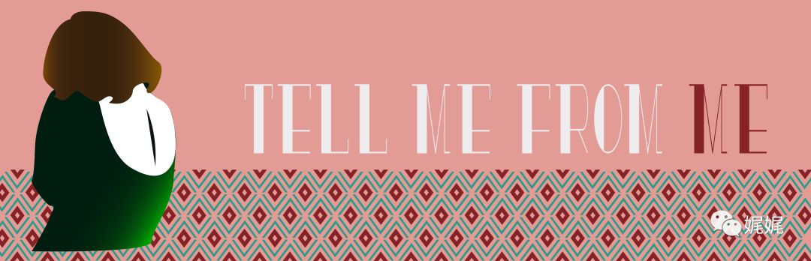

# 无处，化秋凉

> 生活不是演出，我们却要倾尽所有来风光登台。看惯了生活的悲喜起伏，我们便笃定那些文字间的美好，只能是奢侈而不真实的。而那些不幸与忧伤，却又因为我们自己的胆小而被视而不见。欺人、自欺，不如平静旁观。故事，有时候往往只能用来讲述。而走入故事里的我们，只有在章节落成的时候才知道上一篇的结局和下一篇的方向。所以，决眥只为览尽芳华，嚼咀才可品尽百味。

### **【壹】**

穆秋凉本就有一副清冷性子，做人低调。几近单调的生活，空乏恬淡。

这一点，林宋是知道的。只是没有想到，现下的这幅光景里，她仍旧能够持着这样一幅“事不关己”的淡漠表情，着实叫人有些难堪。仿佛眼前这个蓬头垢面，席地而坐的女子，她并不认识一般。

林宋正捉摸着要怎样开口。只见他眉头轻锁，嘴角下弯。本生的清秀的五官，此刻却是拧巴的紧。

身边许久没出声的穆秋凉竟稍稍有了些动作。林宋侧目，目光便刚巧落在秋凉微抬的左手上。肤色白皙、五指纤长，指尖也因了这初秋的微凉而微微泛红。兴许这凌晨两点半的警察局里是的确有些阴冷的。

穆秋凉仍旧没有说话，只是缓缓的把手抚在地上女子的发顶，顿了一会，进而轻柔的揉动女子那头蓬松的乱发，然后五指描摹，温柔的替她将额前的碎发别在耳后。就这样，起先被乱发胡乱遮挡的面容，便陡然暴露在空气里。

那是一张同样单薄的脸，挂着同样淡漠的神情。没有高挺的鼻梁、丰腴的唇形、纤细的柳叶弯眉，有的不过是同样单薄的五官，最多称上清秀的容貌，却绝对称不上美丽。可是，眉眼间那团抹不开的清冷，让她那本就与秋凉有几分相似的面容更加如出一辙。

立于一旁的警员这才有了些许的愣怔，面前这个“年轻女子”，原来不过是个十三四岁的孩子。只是周身都散发着一股子与年龄不相称的冷然和距离感。

兴许是这一阵的动作扰了女孩。女孩缓缓抬头，目光仍旧清冷的在林宋和秋凉的脸上迂回了几次，然后张口轻轻地唤：“母亲”

林宋只觉额角开始震震抽痛。是了，穆秋凉的个性倒是完完整整的传给了这孩子，不是秋凉的孩子，还能是谁的？

母亲吗？身边警员对于女孩的这声轻唤，着实更加讶异了。于是扭头瞄向身旁这个话语不多的女子。

无论怎么看，穆秋凉也不过是30小几的年龄，发丝松散的盘窝在脖颈周围，中分的发型，刘海便左右展开，露出光洁的额头。素色的装扮，不高不矮的身形，还算纤瘦高挑，只是身上穿着一件及膝的宽大风衣，实在没了一点娇弱女子的怜人模样，甚至有些笨拙。

穆秋凉微微的点头，用眼神示意她起来，然后扭头看了一眼林宋，再一次微微点头。

林宋知道，这算是秋凉的道谢了。于是歪歪嘴角，右手不好意思的伸到脑后洋装若无其事。然后，秋凉看向女孩，唤了一句：冉冉，走吧。

这样的女子，安安静静，却太勇敢。

母女的身影悄然消失在夜色里，林宋钻进车里时，自顾自的说了这么一句话。

###**【贰】**

也许是一宿的疲惫，冉冉不消一会便沉沉睡去。

这已经不知道是第几次，秋凉在午夜的凉风里，从外面将冉冉领回来了。明明有着和她一般的模样，也总有淡漠性子的时候，却总还是脱不开那骨子里叫人烦扰的叛逆。

这点倒是像的很。

秋凉凝着冉冉侧卧的背影，静静的想。然后起身，手一挥，房内唯一的一抹光亮也灭了

踱步离开房间，穿过客厅，推门走入阳台。

冷不防的一阵凉意袭来，秋凉顺势抱紧了双臂。这样的天气，在这座常年温暖的城市，倒是不常见的，又或许，心情使然，便格外觉今晚夜里凉。迎着空气里游动的冰凉触感，刚才已然掀起的一阵倦意，也随之散去，脑海中陡然一阵清明。然而，这本该被称作“爽快”的清醒感觉，却突地灼痛了秋凉的神经。她抬手轻轻揉着太阳穴，闭上眼，脑海中便翻来覆去着那些午夜梦回时总展开的画面。

又来了吗？而现在，头痛药和温开水，已然不会自己跑到手边了。

### **【叁】**

如果说穆秋凉对生活还有期许的理由。那么只有两个原因，一个是冉冉，另一个仍旧是冉冉。

换言之，冉冉是她最疼爱的女儿，冉冉是周岂和她的女儿。

不是每个人的18岁都是这样无忧无虑的，至少穆秋凉的不是。这并不是一个义无反顾的莽撞少女，为爱奋不顾身，然后功德圆满的完美童话。因为其一，无关爱情，其二，无关圆满，至少周岂走的时候，并没有说过爱她。而她爱周岂吗？即便是有，但在秋凉这清心寡欲的小半人生看来，这种有关情欲的悸动也不可能留下多少。

那么冉冉呢？始于一个荒唐的念头，却终于一份让她此生最为感动的礼物。

秋凉是孤儿，很小的时候就没了父母。并不是有多悲苦的身世，毕竟家大业大，也没有毒辣的旁系亲属好生虐待。就这么安安静的，秋凉在祖母和舅舅、舅母的照顾下，健康的成长。记忆里，秋凉永远能想起那个她喊作“玉良”的女子。因为舅舅是祖父的老来子，因而与秋凉的父母差了不少岁数，而舅母之前是舅舅的学生，因此年龄上也不过是秋凉的姐姐。这般无隔阂的亲昵，自然在俩人之间深厚起来。

这样的秋凉本该是幸福的。她不骄纵、不胡闹也没有怪脾气，从来面上都是个平平淡淡的乖巧模样，而心里却生的与她生母一样的强硬个性。只是，在这样顺遂的生活里，这种强烈的自我保护色是无需露出来的。直到，她遇见了周岂。

### **【肆】**

遇见周岂那一年，秋凉18岁的生日刚过半个月，而周岂已是28岁的年纪了。两人本不该有太多交集的，直到那个午后。

那天的天气并不怎么暖和，而且微微有些凉。这在7月盛夏的时候是很不常见的。后来的很多时候，秋凉每每想起，总是兀自的笑，兴许那样的不寻常本就是一种征兆，征兆着不应该又不得已的无奈。

怎么就误打误撞的发现了这个真相呢？事后很久，秋凉都是胆寒的。毕竟有一天，你发现了一件十多年都不曾被提起的往事背后有一个不堪且凌乱的真相，这样的结局多半都是让人无措的。而秋凉的反应便是无措之后急转直下的抑郁且不能自拔。她就那样团坐在地板上，看着散落一地的照片。

照片上的是女子是母亲，而男子并不是她父亲。男子吗？那样的容貌和着装，应该还算不上男子，顶多是个高中生的模样的男孩儿。起初秋凉只当是作为老师的母亲和自己的学生有些留影，并没多想。可是一张一张的翻下去，她的右手便隐约有些微微发颤。

捏住照片的指端已然因为用力而发白。指肚下的照片上，并没有什么惊悚的画面。如果说就拍照而言，这张甚至算是一张失败的作品，画面里的人物动作凌乱、随意甚至没有准备好。这是一张合影，很多学生和母亲的合照，只是画面中的两人尤为刺眼。

画面里，周遭的混乱、嬉闹仿佛只是为了衬托出这一份引人遐想的宁静：男生低头轻笑，而女子侧目凝望，嘴角上扬。看不清男生的表情，却能够清晰看见女子眼中有某种东西明灭升腾。

照片翻转，不出意外的，背后有一行小字：人生若只如初见，你在彼岸，恰逢花开。

那样娟秀的字体，在母亲遗物里的几本笔记里，秋凉曾见过。虽然父母走时候，秋凉还小。和所有故事一样，爱她的家人告诉她父母一同驱车离开，然后遭遇车祸，双双遇难。可是为什么要夜里10点一同驱车出去？去了哪里？见了谁？为什么车速那么快？这些都无从知晓，而那时候秋凉只顾着学会坚强，却忘记了疑问。

那行“雾里花”似的的暧昧语句的下方，是更小却同样娟秀的三个字：致周岂

周岂，这个名字从此留在了秋凉的心里。

关于往事、关于真相、关于母亲和父亲。关于周岂和母亲。

之后，秋凉在很长一段时间里都夜不能寐。毕竟凭着一张照片便妄断母亲不忠，是多有不妥的。那样美好的母亲、那样俊朗的父亲、那样被传为佳话的爱情，一张照片便划得这些支离破碎。可是，事实从来都不会因为怜惜你已有的美好而迟疑着不走过来。于是，自然而然的，秋凉查实了真相。这个真相有些悲凉，悲凉到那点对于母亲的记恨都转而化作怜悯和感伤。

母亲喜欢周岂，而周岂并不喜欢母亲。母亲的一厢情愿却招来内心的愧疚、不安。那一晚，父亲发现了这些隐隐绰绰的风影，于是一切发生的有理有据。

 而感怀之后，秋凉产生了多年后，她称之为可怕而荒唐的念头。

### **【伍】**

找到周岂，然后彼此熟识起来。一切都很自然，因为城市不大、更因为从那本母亲上锁的日记本里走出的周岂，于秋凉，似乎早似故人。

周岂说，秋凉你很像一个人，有种熟悉的感觉。

周岂说，秋凉你认识蒋鸢吗？

周岂说，呵，我早该猜到的。

于是和秋凉预知的一样，在他知道自己是蒋鸢老师的女儿后，便提出不再见面的想法。那一刻，秋凉心头冉冉起了一阵清冷的恨意，分不清是为母亲、抑或是为自己。这样薄情疏离的男人，怎么值母亲放弃那般儒雅温柔的父亲？

后来呢？后来在一个不怎么值得称赞的偶然里，秋凉有了他的孩子。是计划之中的事情吗？也许是吧，毕竟那时候，于她、于母亲，秋凉都不希望周岂好过。她是那么想知道一个像周岂的孩子在成长到合影那时的年纪，该是怎样的模样，怎样的性情，又是怎样的成长，生得这般的薄情寡义。

可是冉冉，是个女婴。冉冉，缓缓慢慢的意味。就像她，步履缓慢，不追不赶，却猛然发现，错过太多。

意外总不会形单影只的来，或许这就叫祸不单行吧。孩子、往事、真相以及周岂迟来的“报应”，说是报应，报是当年对母亲的不爱，还是现在对秋凉的不爱，秋凉自己也说不清。

她只记得，周岂被带走的时候，留下了那眸染上浑浊水色的目光以及一段为期15年的等待。

秋凉也说不清楚，现在的自己是不是在等他。只是那眼眸里有太多的东西，她看不明朗又太想知道是什么。再者，现在的身边有了冉冉，便不打算再容个别人。对于她而言，女儿的父亲，却怎么都算不得“别人”吧。

于是，“就这样吧”这样的想法渐渐在秋凉的心里，生根，发芽。

仿佛这几十年的恩怨、爱恨都不过是一场不问对错的“恰巧”，母亲恰巧爱上周岂、周岂恰巧不爱母亲、秋凉恰巧知道了故事并找上了周岂，而周岂也许恰巧爱上了秋凉。缘起，缘灭，看似荒唐又糊涂的这些个交错，却实实在在的填满了秋凉这快二十年的人生。

### **【陆】**

似是呆了太久，想了太多的事情。天边白昼将近的光亮渐渐晕染开来。尽管这样，空气里的冷仍旧丝丝分明的扫过皮肤的表面，引得秋凉一阵颤。双手快速的揉搓了一下上臂，拉紧身上不算厚实的毛衣，哆哆嗦嗦的转身拉开玻璃门，踱进屋内。

隔着玻璃，看着玻璃上映出的自己的面容。那个自己的背后是染尽晨光的城市和天边的五彩云朵。

秋凉微笑，忍不住的对着玻璃挥手，像是对自说再见，又像是在问候这个今天的自己。