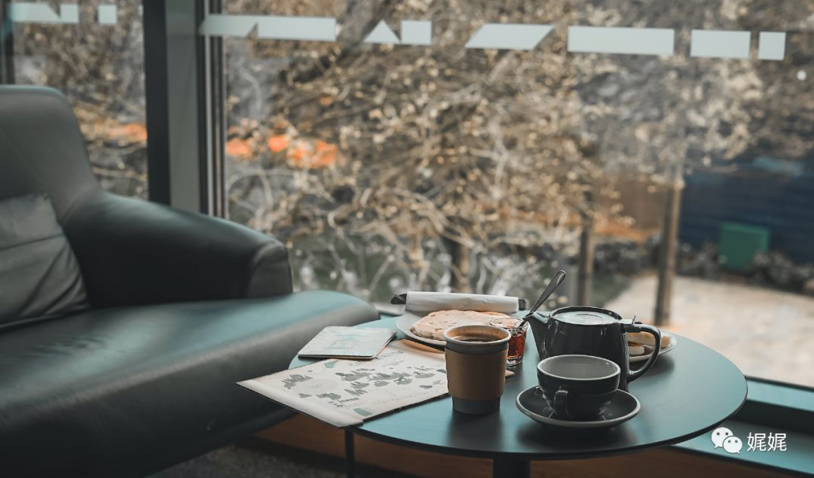
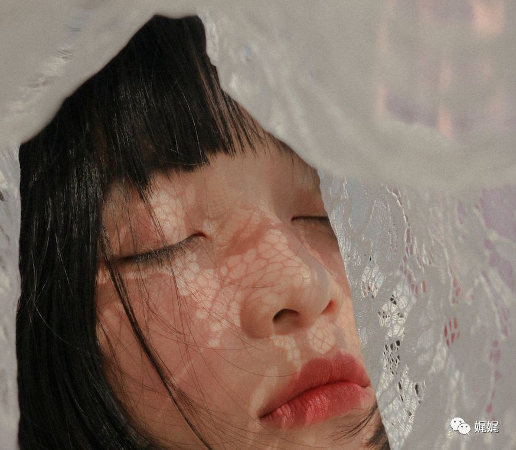

# 朝阳的角落里也有光亮

**“**很多年后，我们或许都能够在回忆里扒拉出星点的遗憾。不管多少，这些都将成为故事能够被记住的理由。生命中，太多的过往是匆匆又来不及计较的。就像转动的地球，白昼交替，四季轮回，不可能永远是温暖和明媚。但是，我们能做的，就是将日月揣进怀里，时刻向阳，微笑，生长。”

------

每个人的心里都有一场名为“生活”的赛跑。也许孤单，也许有时疲惫。但是，总能因着那好似就在眼前的光，而步调轻快。有些人总是习惯对失败过早定论，而有些人，却总能再一次找到“重新开始”的理由。

### **「01」*新模样***

王耀文是三单元的老住户。有一间两室一厅的居室，一辆发动起来就突突突叫唤的破摩托和一只每天都睡到中午才起来的猫。老婆不在的早，供了18岁的独生儿子去外地的大学读书后，王耀文的生活才算是真正的开始了。

年初的时候，男人找了个得空的时间，去买了油漆和些做东西的工具。逛超市的时候，愣是绕了大半个场地，才找到了那些花花绿绿的锤子、扳手。柜台上有试用的电钻，老王把握着，拇指在开关处推上推下，听着电钻刚劲有力的开动声儿，嘴角裂开了笑。

时间总是用跑的。

一眨眼功夫，昨天还在叮叮咣咣、滋滋啦啦，满头大汗的做活。现在就能喝着冰啤酒，轻轻松松的拧螺丝了。最后一颗螺丝也紧好了，王耀文吸吸鼻子，嘿嘿直笑。

结婚那会，王耀文的老婆廖淑媚算是个书香门第的大家闺秀，所以直到现在，房间里的摆设，帘幔的颜色和花纹儿都格外的有品味。换作现在来瞧，也没有半点的落俗感。然而，岁月爬过的地方，早已没了当年的光彩。

踢开脚边的杂物，男人大剌剌的坐在了地上。仰头看门厅天花板上的那盏玻璃吊灯，黄昏的橘色光亮照进屋子里来，茶色玻璃浸染其中，光亮就变得影影绰绰了。

阳光从东边慢吞吞的打到了西边儿，老单元的公共庭院里有火红的花簇，此时也变成了做旧的橘色，纷纷仰头朝向二楼半开的窗口，在窗玻璃上映出一抹红。

起先已经灰败的墙壁被重新粉刷上了鹅黄色。老旧的浅金色帘幔也被换下来，窗户头上的横杆上挂着墨绿色条纹的绒布帘子。房间里大大小小的高矮柜橱都被重新粉刷上了深棕色。王耀文想着，30多年之后的自己，大概就应该是房间里这样的感觉，老旧、传统却崭新新的。

### **「02」*记忆里的香味***

挽起袖口干粗活的老王看上去并不怎么像个教书人，也只有鼻梁上那对儿厚镜片，还散发点墨水味儿。，每每和院子里的邻居们闲扯的时候，说起年轻时候在小县城里教书的那段时光，老王总是低头笑。

那时候年轻，想干什么，又刚巧了有点文化，就可以去干点什么，比如教书。王耀文在家乡的小山村里算是个读过点书的文书生，长相又干净清透，说话也得体大方。所以，18岁一过，他就背着点包袱出了村口那片麦子地。

半工半读的在县城的中学工作了小半年。那段时光对王耀文来说，是最美好的了。学校虽然不大，但有间不小的图书馆。说是图书馆也没那么高格调，既没有宽敞透亮的阅览室，也没有正儿八经的借书证，就是书多。老王每天的工作是带几个班级的语文和数学。那会的课程难度都比较低，学生们也没那么刁钻，所以照本宣科基本上就能完成每天的教学任务了。其余的时间里，王老师就爱带着孩子们盘踞在图书馆前面的小草地上，一坐就是大半天。

不过，最美好的应该是认识了廖淑媚。

廖淑媚是隔年进到县城里来的。也不知道是个什么由头，就走进了这座中学的课堂里，教外文。那时候，外文是个稀奇玩意儿。王耀文倒是花过钱去看过场《罗密欧与朱丽叶》。所以，第一次听廖淑媚讲课的时候，他心里、眼里都是亮闪闪的，感觉讲台上的淑媚就是那电影里的朱丽叶。

不过，他们从恋爱到结婚也是坎坷。王耀文还记得第一次鼓足了勇气上门提亲的时候，隔着门槛，就被廖淑媚的父亲拦住了。老人说了什么，他没大听清。只是透过门缝，看见淑媚的脸上雾蒙蒙的。

说到最后，老者有些不耐的赶他：“你到底有没有在听我说话。我让你请回吧，我是不会同意你俩的事儿的。”

可是事情要是到这儿就结束了，那革命意识就太过浅淡。大概是受了电影的启发，两人愣是瞒着父母，偷偷摸摸、兴高采烈的领了证。

很多年后，淑媚靠进老王的臂弯里，看着夜空中的星星。嘴里最爱念叨的还是那部电影里台词。有一句他俩都特别喜欢，但老王看了好几遍都磕磕巴巴。最后只得作罢，将这句话誊抄在了随身带的小本儿的封皮上：

“In the book of the destiny, we together between a row of characters.” 

好像在说，他俩的相遇、相守都是命中注定的。

### **「03」*蒙尘***

爱情滋养过的教书时光，匆匆过去。疲于奔波和生计的老王，无奈的带着新婚妻子告别了讲台和那座热爱的图书馆。不久，白色开口的衬衣变成了灰黄色的工作装，一丝不苟的三七分变得乱糟糟。而洁白清爽的布鞋，也换成了厚重、脏兮兮的雨靴。以前的教书先生摇身变成了大老粗，鱼贩子、修鞋匠，或者老木匠。王耀文就这么粗糙又陌生的过了很多年，直到妻子离开，直到儿子考上大学。

虽然不教书了，但从前的课本倒是一本也没有丢掉。悉数被妻子小心摞放在柜子的最里面。因为每晚熄灯之后，搂着丈夫的廖淑媚听到到男人睡梦中粗重、疲惫的呼吸声，总有点心酸。她常常在黑暗中凝望，凝望男人如山脉一样绵延安稳的背影。她晓得，山的那一面，隐隐还有光亮。

所以，翻新柜橱的时候，王耀文在一堆破烂的报纸后面，发现了那摞课本。还有些残缺的笔记本。翻开，原本深黑色的墨渍都有些脱色，变得灰蒙蒙的。不过，还能看见那些刚劲有力的字形，和笔画间流动的一股子倔劲。

老王翻看着。突然，摊开的纸面上被滚落的水珠打湿了去。这一页上有一行小字，墨色要新些，颜色是墨蓝的。他太过熟悉这样的字迹，因为每一处落笔都有模仿不来的回勾。

“你让我明白了：即使无法一直浸没在阳光里，也要努力的向阳生长。因为，没有光亮就会迷失方向。”

模糊的水雾里，仿佛能看见第一次见面时，女子身上剪裁得当的淡绿色旗袍，还有嘴角那一抹浅淡的笑。

### **「04」*回暖***

三月初的天气开始有些回暖。早前被闲置的阳台里，摆放了三层的金属花架，上面放满了大大小小的花盆。发芽早的已经冒了绿色。沙发上、茶几上、床头矮柜上，到处都安放着书本。

原本开阔的客厅里有一张新买的书桌，桌面上是一叠新写的文稿。不远处电视的画面里，男人俯身在高耸的墙头，动作缠绵，遥望着墙头那处半开的窗。

“In the book of the destiny, we together between a row of characters.”

这句，依旧是老王挚爱的词。

