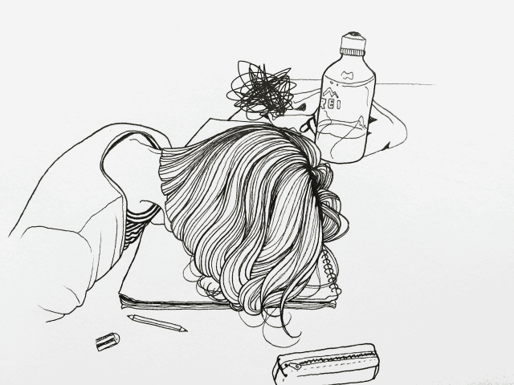

# 楼上的猫小姐

（—pictures from internet）

### 【壹】

床头柜上的钟面，端端正正的显示：6点10分。不同的清晨，都以相同的开场，在同一个时间开始。我被迫着挣扎坐起，烦躁的揉着头发，然后抬头迷糊的死盯着天花板。

楼上的新住户，准确的说是她的cd机，从某一天开始，已然完全取代了我的闹钟。

对此，我虽然并没想替我那任劳任怨好几年的小东西申诉抱怨，但是对于这个新来的擅自将本姑娘的起床时间整整提早了2个小时，这让我着实不高兴了。

所以，在我又一次因为上班时间打瞌睡被主编用社里的周年合订刊狠狠砸中后脑勺时，疼痛化作一股子怨念从我的七窍中喷涌而出。

第三天，在楼上的那个大小姐搬来的第三天，我决定要上楼去看看。说起我在住的这栋公寓，还是蛮有感情的。当时我刚刚大学毕业，打算留校读研。说实话，父母给的家教很严，所以想到研究生已然不再需要每天定时定点上课点名的时候，我想搬出宿舍，自己住。索性，认识的学长课余打工认识的张阿姨有一套待租的小公寓，慈眉善目是第一次见面时对阿姨的印象，于是便安心住下来。

公寓有些老旧，岁月的色彩却着实让灰白的墙壁显得温暖。邻里都是常住的中年夫妇，又或者和我一样的年轻学生。我很喜欢。

只是楼上的房间，上个月空出来了。原来住着一个诗人。说是诗人，大概是大我几届毕业的文科硕士，在毅然拒绝让伟大的文艺复新诗歌在完全无心学业又只图混过毕业的学生课堂里流血流泪之后，他彻底失业了，继而在对这座城市绝望之后，他提起行囊准备离开。

我还记得他离开的那个早上，敲开我的门，给了我一箱诗集，他那忧郁的小眼神，淡淡的穿过我，似是看着虚无的远方。

好吧，我真的不明白，但是他做到了，那间房里一定弥漫了哲思的香气，才吸引了这位异于常人，却在我看来仍旧有艺术家气质的新住户。

我洗漱完毕之后，对着镜子扭头看了好久，确认连眉尾的杂毛都修剪完毕，我才潇洒准备出门，却在关门的一瞬间发现错穿着秋裤。

—“果断是关心则乱啊，这手忙脚乱的。”

于是，在起床2个小时后，我终于站在了那姑娘的门口。

### 【贰】

我停顿了足足5秒才说出第一句话。

—“猫小姐，您好。”

门后面那张脸，愣了一下，继而仍旧用略显惊恐的表情看着我。

就是这幅表情，让我想起了家里的小咪，那只咖色黄点的小猫，典型的傲娇个性。那么胆小却大着胆子在上个月出逃了。

我想了它整整一个月，却在此刻从心底涌上一股“破镜重圆”的喜悦泪。

—“我不姓猫，我叫尧小米。”

细小的声音，重重的拍醒了愣神的我。

—“你好，我，我叫贾言，我住你楼下。”

在她的和风细雨面前，我的声音真是平地一声雷，惊得我自己都结巴了。

（—pictures from internet）

我们就这样对视着，谁也没在开口。

“喵呜——————”

原来，她养了猫。

—“你等一下，我接个电话。”

再一次，我傻掉了。

尧小米转身进屋去找手机，想来如果不是现在的猫都能喊主人接电话了，那一声猫叫大概是她的手机铃声。她离开，就留下那半人宽的门缝。我伸着脑袋朝里探望，脑袋里想，还是很像猫窝。房间和我的套型是一样的，一室一厅，但是却完全没有了架构的模样，满满当当，已然分不出来哪里是走道，哪里又是墙壁。

猫小姐的猫窝，真小巧啊。

### 【叁】

之后，每次聊起那第一次的见面，小米总是低头闷闷的笑。她很瘦，骨架很小，皮肤很白，触感是柔柔软软的。她家很特别，她说那是北欧的复古风格。我曾用一个下午在她的小窝里转着圈踱步，手指抚着那些才及我腰的矮柜台面，从来都没有丁点的灰尘。她喜欢碎花图案、简单的蕾丝图案以及粗布触感的粗粝材质，客厅有一扇一人高的台窗，窗台的宽度刚刚好容得下她抱腿团坐在上面。所以，每次去，窗台上固定有一只小巧的碎花抱枕和一只随意摆放的粉色马克，然后就或是耳麦或是画册又或是日记本。每次看见这样的场景，我都会闭上眼睛，脑海里便是被唤作猫小姐的她乖巧的团身窝在窗台上的样子，她的侧脸很安静，线条柔软，我甚至能想到午后和暖的光影在她的脸颊上摇摇晃晃。

有一次，我和往常一样，在3点半的时候，拎着上次她说想好要看的两三本诗集，小碎步的跑向她家。说起来，诗人算是我们熟识的牵线人，他的那箱诗集七七八八的被小米看掉了一大半。隔着那扇房门，我就能嗅到热牛奶的香气和煮开的绿茶散发的沁人气味，令人舒心。

—“我来啦！”

我隔着门高声的唤她，然后便是一阵凌乱的脚步声从门后传来。

门开了，小米笑着喘气。

桌子上是烤好的小蛋糕，还有刚刚勾调好的热奶茶。我和往常一样大喇喇的窝进沙发里，自然的啃起面包，小米则笑吟吟的拿来搪瓷杯，给我倒奶茶。她就是这样，笑起来就像一只没有胡须的小猫咪，嘴角弯弯，轻轻巧巧。

（—pictures from internet）

当她捧起诗集，走向窗台时，我叫住了她。

我问她，为什么总是那么早起床。

她轻轻巧巧的说，因为不想错过清晨的阳光，一天有光亮的时间那么有限，舍不得浪费在被窝里。

我又问她，为什么喜欢读诗呢。

她抬头看着我，歪歪脑袋，说，因为读不懂啊。

我愕然，读不懂所以喜欢吗，真是只古怪的小猫。她没再多理会我，转过身再一次窝在了窗台里。我自嘲的耸肩，然后扭头看着电视。她读诗集，我则就着免费的下午茶看复播的肥皂剧，这样的下午，我们一起不知不觉度过了一整个秋天。

可是，冬天来的时候，小米却离开了。

（—pictures from internet）

### 【肆】

那是一个平常的早上，一觉醒来，手机上却闪着已然陌生的时间：七点半。我糊里糊涂的摸下床，回想着昨晚可能是真的喝太多了，小米往日那么大音量的爵士乐，居然一点没听到。

看着一只脚上的拖鞋，我只好弯下腰，撅着屁股四处翻找它的另一半。手指却在扫过鞋柜边线的时候，摸到一个小信封。粉色底上缀满了淡紫色小花，可爱小巧。我缓缓站起来，慢吞吞的拆着信封，捏着信纸轻轻展开。

贾言：

刚开始我从张阿姨那里听到这个名字的时候，以为是男生。

其实，你错了，早上起来放音乐并不是我的习惯。幸好房间的墙壁没那么厚，不然，放了那么久音乐，我的耳朵可要聋了。只是想要和你，有点联系，想着和自己一起起床的你。

还有，那天你来我家，并不是我第一次见你。

我还记得，在你们学校门口的路边，你等车的样子，很好看。

这边的公寓是我姑妈的，本来是打算在出国前来这边玩玩，没想到能遇见你。

贾言，明年夏天，我还会回来。到时候，我去找你吧。

好吗？

### 【伍】

放下信，我缓缓站起来。开门，朝着楼上走去。

小米的房门上，挂着一把小巧的钥匙。打开门，房间里依然有着残留的奶茶香气，还是满满当当的猫窝，茶几上有一只大大的餐盒。

是蛋糕，我最喜欢的抹茶口味。

早晨的阳光从那扇台窗的玻璃中投过来，洒在地面上。我拿起一个蛋糕，踱到窗口，小口的吃起来。

还记得当时她用小勺往料里面加抹茶粉的时候，我抢过那只指甲盖般大小的勺子，换给她一只两倍大的汤匙。口中的抹茶味，浓浓柔柔的，很香。

空气里已然抖动着一丝的清凉，看来，冬天真的要来了。