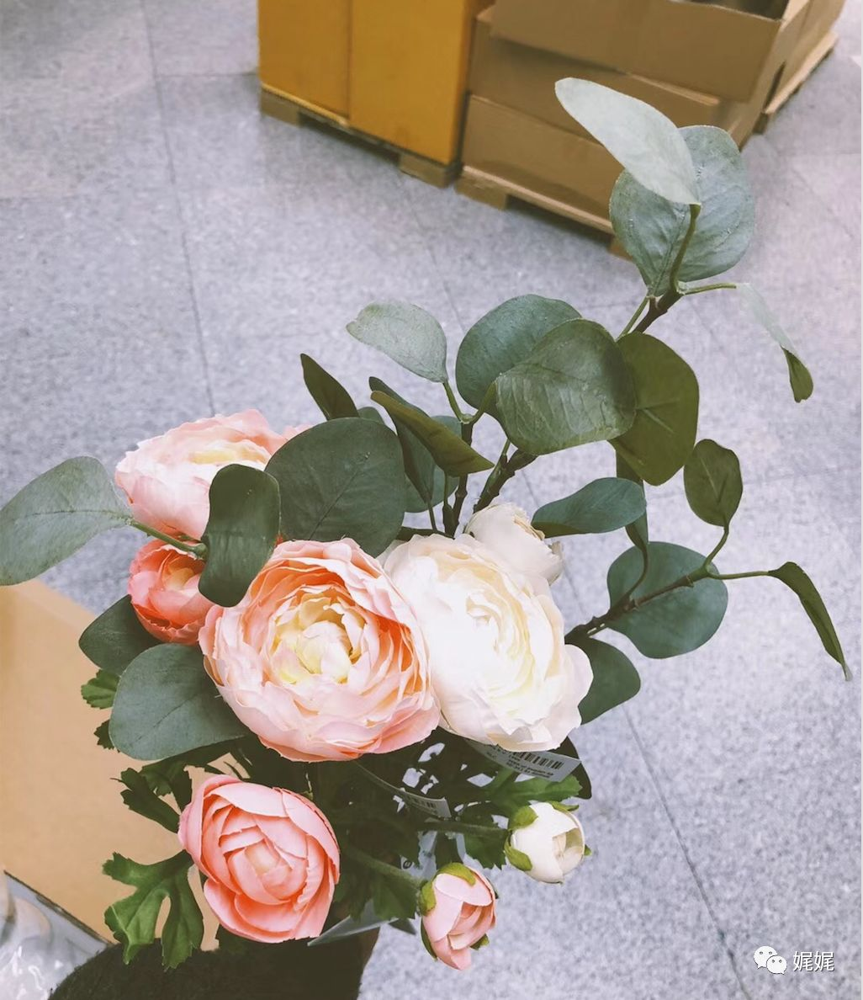

# 欢梦易逝，近景尤奢

“曾录于“蔷薇岛屿网络电台—二三事”by NJ小楼”

> 有时候，我们日思夜想的事情，不过是一场空欢。我们独自行走在这片丰沃却荒凉的土地上，本该有的敏感和细腻，却随着渐行渐远的时间，而被悄然磨去。而自己，顺着心底渐生的麻木与陌然，变得平常与拙钝。然而，喜悲萌生在外物上，偶有时光，指眼触及的地方，就能够悄然绽放出一片收不住的盛大。

### ***「壹」***

7点05分，我从厚重的棉被下，艰难的伸出右手，朝后背的方向探过去，摸索着边柜台面上的闹钟。

每天会选择这个奇怪的时间点起床，阑夏说是我的怪癖。他说这话的时候，是正在厨房忙活的空档，而我，彼时正窝在沙发里用笔在本子上涂涂画画：15分钟的洗漱、10分钟的挑选衣服、15分钟快速的穿戴整齐、10分钟的化妆梳头还有20分钟留给闹铃响后的挣扎赖床。7点05分的闹铃，满满当当的，才能差不多在8点半站在车站等车。

阑夏说，明明是9点多的到班时间，这么疲惫还不是自己拖沓折腾。

而我呢，只是笑笑，不言语。阑夏总是嫌我孩子气，而我就这样从后面环住他。用脸贴着他宽大的后背，不说话，他便会妥协，然后变做往日一般，对我温柔和宠溺。

冬天之后，家里就会换上这种厚重又实在的羊绒被。我喜欢被压迫的睡眠，所以每次汗湿之后，阑夏疲惫而沉重的身体瘫软的覆盖在我身上，而我却总是习惯在他耳边唤他，别离开。那样温热而真实的重量，就好像一种存在感被证明，好像生命，好像活着。

闹铃被我摸索着摁停，鼻端却摩擦着被口，又往回缩去。左手臂外侧的皮肤上，烫热体温的触感渐渐清晰起来。阑夏似是感觉到我一丝的动作，闭着眼转过身来，将我揽入怀中。热与燥一瞬间把我包裹住，突如其来便显得压迫又沉闷，耐不住，我便动作着挣扎起身。

7:15，今天的苏醒格外早。

洗漱、挑衣服、着装、化妆、梳头，从来都不特别在意精致妆容的我，并没有在这些连环的琐事上浪费多少时间。很快，在一阵动作之后，我拖沓着从鞋柜里随意提溜出一双高跟鞋，踱到门边。

7:45，今天出门的时间格外早。我回头望向卧室，脑海中想象着此时被窝里阑夏安稳的模样。他一定还沉静安稳的睡着，伴着悠长的呼吸，睫毛因呼吸而发生的微微颤动。他应该还不准备醒来，他从不是焦躁的个性，所以清晨总会直到特定的闹铃响起，才会慢慢醒来，然后和往常一样在8点半穿戴整齐的下楼开车。

他从不提早，因为从来不担心意外。阑夏总说，可控的意外，发生都是对自己的肆意骄纵。而梦欢，你便是那种任性又肆意妄为的人，所以在你的人生里，有那么多意外和无奈。

此时，站在门口的我，抬头再一次望一眼门头上的钟面，胡思乱想间，分针又跑过了小半圈。

### **「贰」**

婚姻，阑夏，应该。这些零碎的词，好像本来就应该组合在一起。离开家的时候，我只随身带出了1000多块钱，然后独自推了行李箱来到一座不熟悉的城市。火车开动的时候，面朝着窗微笑的脸渐渐随着窗外人影的后移消失而消失，那些熟悉的人和景都被飞速的车厢甩在了很远的后方。那些被乖巧、勇敢和深思熟虑精心包裹起来的叛逆和逃离企图，逐渐在风中燃烧化作灰烬，又被快速移动带起的风吹的干净。独立和成长，不过是我想要叛逃的借口，对于那个近乎封闭又类似禁锢的家，即便是在梦里，我也想过要逃离。

于是，选择这里。

而选择婚姻，我从来不觉得是另一种禁锢。因为是阑夏，也因为嫁给阑夏的是我，尧梦欢。

### **「叁」**

14楼的位置，很高。而我的座位刚刚好，靠近这面通彻透亮的落地窗。

杂志社的工作总是无章法的乱和忙碌。外采或撰稿，工作总是接踵而至，而我却总能够接的顺手熟练。

马俏俏说，我天生就是工作狂的命。别看我懒散冷漠平平静静，可是一有活来就两眼放光，一派专业模样。马俏俏是我隔桌的美编，每天百分之七十六点三的时间都是对着藏在笔记本后面的大镜子涂涂抹抹。每每我按时下班，她却总要磨蹭着继续作图。

而阑夏呢，大概从来都看不见我这样可以称之为精干利索的模样。而我，也乐得懒散又不负责任的对他依赖和索取。

午休是我一天中，最放松的时刻。14楼的位置，好视力的我总是爱在空闲的时候靠着玻璃向下望。这个位置和角度，刚刚好，能望见写字楼门口左手边的公车站。

而望向那里，已然成为一种习惯。

### **「肆」**

我已经不记得第一次是哪一天了，我只记得那天是下雨的。而我，一直最讨厌下雨天，没有来由，只是讨厌那种淅淅沥沥的粘稠感，像人们拖泥带水的情感，总是少了一丝的清爽和干净。

和往常一样，我端着一杯温热的红糖姜水，半倚在玻璃上向外望去。每次温热的液体顺着喉管蜿蜒向下流淌，我能清晰的感觉到热流进入到我的五脏六腑，然后舒坦的感觉便蔓延向四肢。杯子里的红糖姜水并不是买来的速溶，那种粉末勾兑出来的，一向效果不佳。而我又体寒的厉害，所以总是只喝得惯母亲用老姜泡制的。也不知道母亲是怎么做的，那些浓缩的液体像中药的制剂，在砂锅里煮沸，然后用一并寄来的保温壶装好。每个月的这几天，母亲总是分毫不差的寄来，而我总是乖巧的带上保温壶来上班。

杯子里深红色的红糖姜水仍旧有些微烫，白雾萦绕，雾化了近处的玻璃。鼻端能清晰的嗅到老姜微辣的气味儿。

我低头尝试的嘬，却还是被烫的龇牙咧嘴。

然后，我看见了一个孩子，在那处被雾化了玻璃后面。一个初中生模样的女生，扛着一把花伞站在车站的候车棚里。

而那时，我才注意到起先淅沥垂直的雨丝，已然飞斜，变做猛烈、倾盆的大雨。倾倒一样的水量从候车棚的格缝间砸像那把似是遮阳用的花伞。

女生被伞遮住了大半的身形，模糊看不清动作和表情。但视线可及的裤脚和白球鞋都染湿了，而花伞在倾盆的雨水下也是摇晃剧烈。偶尔，被强风刮歪了的伞下，露出少女部分的面容，模糊间看不清表情，只能隐约看见她用双手使劲的抓握住伞柄。

应是看的入神，指肚被杯壁烫的一阵麻。我才意识到自己也因为担心而握紧了杯身。心下是有些责怪孩子不懂的变通，这么大的雨应该是找些牢靠的建筑物来躲避，心里又暗自揣测着楼下的保安该是看得见这一幕，会马上出声招孩子进楼来避雨。

正当我纠结得时候，我看见远处有一辆摩托车快速得骑行了过来，却在经过车站得时候明显减了速，而女孩居然拽着伞迎了上去。

14楼毕竟是太高了。我看不清楚来人是男人，还是女人，只看见那人的周身披裹着类似于雨衣的东西，厚重笨拙。他在靠近孩子的时候，完全停止了加速，而是用脚在地上滑动着，把车移到孩子身边。

女生依旧打着伞，而车上的人有一些动作，接过女生递过来得书包。

车上的人把身前得雨披掀起来，我这才隐约看见那人的脚，好像是蹬着一双高跟鞋，鞋跟歪扭得卡在车两侧得保护杠上，似乎是想腾出更多得空间。

后来，车，载着两人，由缓及快的远去。

高跟鞋，那人一定是孩子的母亲吧。我突然一下子明白为什么孩子不愿离开车棚去远处躲雨，是约定，也是相信。

我低头，唇去摸索杯沿，触到杯中液体的时候，发现红糖水有些微凉。

### **「伍」**

后来，我常常会靠在那里，或喝咖啡、或吃水果。只是那样慵懒的站着，半依着玻璃，目光却期许的望着那处候车棚。

有时候，是一对争吵的恋人。女子狠戾的甩了男子耳光，男子仍旧上前拉扯，女子挣脱，然后相拥住失声痛哭。

有时候是结伴的下课学生。男生嬉笑结伴，在跑近车站后望见候车的独身女孩，和他们穿着一样的校服。然后，男生开始哄闹追打，却始终不敢接近女生。直至车到，女孩都很安静，似乎未察觉到身后发生的一切。

记忆深刻的，是一对老人。他们彼此搀扶，不急不慌的从远处踱过来。走到候车棚下，却并没有在矮凳上落座。在夕阳的余晖下，老人相互搀扶。我能想象出他们微微扬起的面庞上，光在岁月的沟壑中流淌，嘴角一定扬起了好看的弧。

有时候，只有匆匆来回的路人、焦躁不安的候车人，甚至是在矮凳上休憩的窘困旅人。可是，即便是不多的动作和完全无声的画面，也似是一个故事的开端，总让我驻足守望。

### **「陆」**

之后的很长一段时间，我习惯租来成摞的旧默片，或一个人，或拉着阑夏一同看。我不管他，独自喃喃自语，给他们配上对白。有时候，剧终落幕，来不及开灯，面颊已是半湿。

阑夏说，梦欢，原来不言语的时候，你也会动情。

而我，只是把他扳过身去，从后面环住他，把侧脸贴进他宽大的后背里，任由温热湿透了他那块衣衫。

  阑夏，其实我只是贪恋一场欢梦。那些骄纵肆意的无奈，原来不过是我自己构筑的网。而原来，网眼外的世界是这么的真实而美好。

### **「柒」**

生命中太多的人，给予我们宠溺与放纵，而我们却总是想要更多。不管该与不该，我们直管一味的索取那些看似还不曾被拥有的东西。要的，不过只是那句 “所有”与“任何”。久而久之，“得到”变成了一种类似于标记的动作，我们只在乎有多少是属于我们的，却不去管属于我们的都有什么。囫囵吞枣，终究遗失了太多的美好。

然而，倘若我们有片刻的停步。回头望一望，所拥有过的、正怀抱着的，都是闪着微光的钻，难得又珍贵。

一场欢梦，其实，只有醒来之后，才能明白：欢梦易逝，近景尤奢。