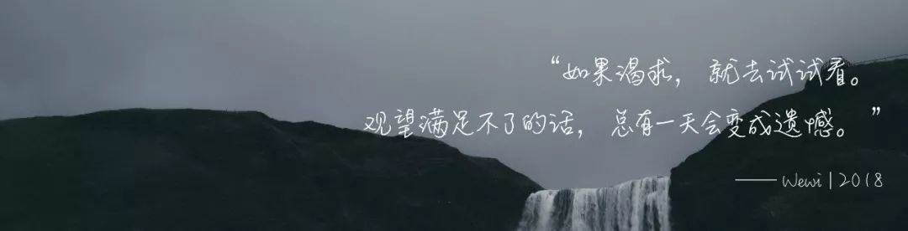

# 班机不飞西雅图

**“** 寻求一种只有两面的生活，在一面受挫了，就慌张奋力的逃到对面去。可是，也许，这本就不是一种生活的两个面，而是截然不同的两种命运。**”**

------

[^]: From Pap.er

### **「01」*Sigh***

3点半的天空本不该是这般昏昏欲睡的颓废模样，可是遇上了11月份的微凉空气，好似染上了冷色调的一切都显得正常，甚至有一丝可爱。

伸展开双臂，伴随着后腰的一阵酥软，我仰面，直直的倒向了身下柔软的皮质沙发。嗯，这样的触感，纹理细腻，疏密交错。我扭转过身子，侧面贴靠在沙发的坐面上来回磨蹭，然后缓缓闭上双眼。

“我什么都没有，但我有包。圣诞节有个包，春节有个包，三八妇女节有个包，连六一儿童节都有个包!都是包都是包!”

耳边传来电影里文佳佳自嘲的话。

我缓缓抬起头，目光悠悠的落在睡房半开的门上。我没有包，蒋然也曾经想给我买包来着，可是被我回绝了。一个女人拎着一只好包，却装着价值不及包价零头的乱七八糟。还是鞋子好，至少踩住它们昂首阔步的女人，是我自己。

《北京遇上西雅图》是我自己买回来的碟。

平常的我，宁可上网看枪版，也不愿意形单影只的抱着爆米花去电影院，然后因为售票小姐冷冷的那句：“一个人只能买单号”，而永远坐不到影院的正中央。

可是，有一次在办公室卫生间的隔间里，我听见邻间的两个吞云吐雾的女人如是的对话。

“听说汤唯去演了小三儿。”

“哈，网评不好呢，说什么给小三儿平反之类的。现在社会尺度越来越大了。”

于是我鬼使神差的买了张碟，又鬼使神差的看了好多遍。

平反吗？每次看着同样的情节和对白，我总是忍不住想笑。走了这么久的自己，终是发现，生活本就没有什么完全的非黑即白。不可名起全貌的，才是生活它本来的模样。

`From Pap.er`

### **「02」*Empty***

认识蒋然，其实并没有那么周折。我不知道文佳佳是如何遇到老钟的，也许是一次华丽却不怎么值得称赞的邂逅。可是蒋然和我，是初恋。认识许多年，却又彼此分开了许多年。后来，就像是俗套而泛滥的那句总结语：一切都是为了爱。我就稀里糊涂的做了小三。稀里糊涂吗？我也不知道，只是作为一名律师，我想从意识到行为的执行过程，清醒完成的我，并不是受人指使，亦不是神魔附体之类的中邪，只是任意妄为罢了。

我并没有辞职，他也并不打算和我结婚。家里的蒋夫人大抵是不知情的，毕竟昨天我还以他们的离婚律师身份，前去拜访过女主人。当时蒋然找到我，说他把我推荐给了他的妻子，希望我能帮他们处理好离婚的相关事宜。当时我有一瞬间的怔愣，可是很快，职业操守要求我冷静的接过他递过来的名片以及文档袋，然后端正坐回我的办公桌前，与他一桌之隔的开始公事公办。

[^Pic]: From Pap.er

对于与蒋然之间，倘若说是君子之交般的一清二白，那定然是撒谎了。也许先前彼此之间尚有些芥蒂，时间和空间上也多是不便利的。可是他和夫人的离婚，却恰巧促成了彼此见面的小聚。也不知从何时起，我已然能在蒋然的臂弯里安然入睡，我并不认为这个男人有多能让人依靠，也着实不认为我有多么爱他。也许就像相互依偎取暖的刺猬，即便疼痛，也只好因为疲惫而不再折腾了吧。所以，每一次当面颊汗湿的他，在我耳边轻喃的问，我总是装作没听见。

我总以为能让迷离涣散时的自己，仍旧清醒的那句话，终不该是那句爱谁的浪漫情话。

### **「03」*Smile***

爱情本不该是如此。可当这个古人都矜于开口的词汇，成了大家津津乐道的口边话题时，爱情的模样已然不再是最初那般透亮而简单了。很多时候，它成了一个借口，像一张无穷大的布衫，横竖围转，便能包裹住一切的不堪。爱情吗，就像佳佳的那句，真正的爱情是奢侈的，而自打文佳佳安于与人共享老钟的那一刻起，那便不是爱情存在的样子。

所以，我不曾要求蒋然娶我，而我也不曾扮演过那段苍白年岁里，痴情苦等的“初恋”。我们用各自能够习惯的方式相守，各取所需。

那个下午，我们隔着办公桌，谈了很久，都是关于工作的话题。文档袋里是他妻子另有情人的照片，以及他们婚前财产分配的相关文书。蒋然淡然的笑，言语间没有一丝一毫对扮演出墙红杏的妻子的指责。而我执笔，在面前的纸面上记录着谈话中的关键点。谈话结束的那天晚上，我没有留蒋然。房间里，我没有开灯。桌面上是那封厚厚的文档，而桌旁一侧的废纸篓里，是一捆这些年我写给他却未曾寄出的书信。

所以，爱情啊，聪明的人便越难遇到。

却总有些时候，我们来不及装傻。

[^]: From Pap.er

### **「04」*Wake***

电影的对白还在继续。文佳佳亦然高昂着头颅，高翘的下巴却怎么也提不住下坠的心。情节早已烂熟于心，乏味极了。我抬头扫过对面墙壁上的钟，4：10。

今天是周末，明天蒋然就要恢复单身了，而上午他打来了电话，说是晚上要过来陪我吃饭。还有半个小时左右，我低头看了看身上的睡衣，和散乱胸前的发丝。

身体软软的向后仰躺在沙发上，却一点化妆的心情都没有。

[^]: From Pap.er

爱情就像一道题，有时候我们错了，却总是纠结于是否套错了公式。然而，回到最初，或许从开始，我们就读错了题。

寻求一种只有两面的生活，在一面受挫了，就慌张奋力的逃到对面去。可是，也许，这本就不是一种生活的两个面，而是截然不同的两种命运。

有时候先于思考的双脚却选择心想要去到的方向，所以走走看看，也许比惶惶不得起步要少些错过。

从来就没有A到B就能到C的唯一顺序，也许会哭，这便是生活。

