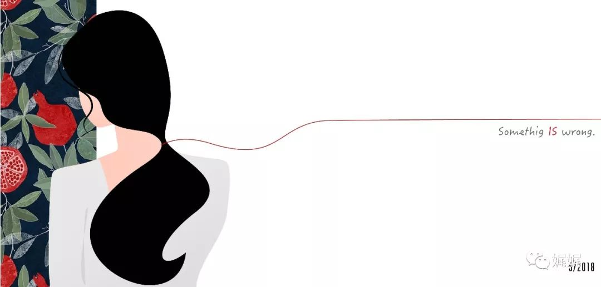

# 第三次看见

### **[霾]**

“2，3，4，5…”

数着屏幕上缓慢攀高的数字，周瞳能听见自己鞋跟滑擦地面的声音。周一的早上，她并不想迟到。

文件袋里是今天会议要用的文件，隔着牛皮纸，她烦躁的来回摩梭着。

“怎么还不来？”周瞳再一次抬头查看的时候，红色数字刚刚好停在了“15”，电梯门应声打开。

周瞳一愣，赶忙向前迈，文件袋却一个没拿稳，哗啦掉地，刚好压在梯门线上。周瞳惊呼一声，慌忙蹲下来去捡，视线冷不防扫见不远处的一双白球鞋。

“不好意思，不好意思。”她捡起文件袋，一个跨步走进了电梯。周瞳本能的转身，面对电梯门，目光扫一眼梯门右侧，-1楼的按钮闪着红光。她上前在“1”上按了一下，然后一个退步跨回原位，低头盯着自己的鞋尖。

太尴尬了，快点到1楼吧。周瞳闭上眼，皱眉想。

不知道在哪一层楼，电梯门开了。可是并没有人走进来，于是门又关上，继续下行。又隔了一会，周瞳抬头看了下，5楼。透过电梯门的金属面板，她看清刚才那双球鞋的主人，一个高瘦的女孩子，安静的站在自己的右后侧。那人身形消瘦，目测身高在160左右，一头披肩长发上的鸭舌帽压的很低。周瞳看不清她的脸，只看见帽檐有一圈金属色的镶边，在电梯顶灯的照射下，微微发亮。

“没见过这姑娘啊。”周瞳在富春花园住了快2年。进进出出单元楼，上下楼层的房客都或多或少的有遇到过。九江区这两年发展的快，富春花园相比于那些拔地林立的新地方，也算是旧小区了。左邻菜市，右邻九江二小，距最近的商圈也要30多分钟的地铁车程。所以，小区里老年人居多。

印象中，没在单元里遇到过这个姑娘。

“1楼到了。”周瞳正愣神的时候，电子音打断了她的思绪。她抬头看了看数字，电梯门也应声打开，于是她抬腿准备迈出门。突然，身侧传来一阵响动，一股不大的冲击袭来，撞得她歪斜了身子。周瞳“哎哟”了一声，慌忙用手肘撑住了扶手，文件袋也掉在了地上。

周瞳惊魂未定的望着前方，才意识到刚才应该是有人撞了自己。她看了看四周，才发现原本站在电梯角落里的女生已经不见了。心想，刚才撞到自己的人，应该就是她。

“怎么慌慌张张的，吓死人了。”周瞳一边捡拾起文件袋，一边站起来，然后走出了电梯。

### **[雾]**

“要加辣吗？”

被老板娘问到，我收起了飘远的思绪。

“少一点辣，加点香菜吧。”我一边拿出手机，扫码付钱，一边答道。老板娘动作麻利的在摊开的煎饼上，将蛋液涂抹均匀，撒上两把香菜碎和一小勺辣椒面儿，然后利落的把煎饼裹好、切半儿，装进塑料袋里，向我递过来。

我接过袋子，点头谢谢她。正要扯开袋子摆弄，就感觉到裤兜里传来震动。我腾出手指捏了捏耳机上的按键，然后继续摆弄塑料袋，啃起煎饼来。

“周瞳，你到公司了吗？”耳机里传来夏苒的声音，听上去有点急躁。

“嗯，快到了。买早饭呢。”我一边吞咽，一边模糊的说。

对面安静了一会，夏苒的声音飘远了一点，似乎在对身旁的人说着什么。我隐约听见“快去”、“通知”之类的字眼。

“夏苒，发生什么事了？”我忍不住对着麦唤她。

“周瞳，你一会别从正门过来了。那边路给封起来了。你走园区侧门吧。快点过来，总经理要开会。”

开会？项目启动会不是下午吗？我紧了紧腋下夹住的文件袋，满脑袋疑惑。

电话对面，夏苒又交代了几句。大致上就是叫我快点到公司，总经理心情很不好一类的。我挂了电话，把剩下的小半口煎饼在塑料袋里裹了裹，丢进身边的垃圾箱。快步朝着公司园区侧门的方向奔去。

公司园区在莫香路和武定路交叉围住的区域内，正大门对着莫香路，而侧门则在武定路上。我所在的部门在3号楼，位置上更靠近侧门。不过，园区日常只开正门，因为侧门无法通车。所以，夏苒说正门被封的时候，我感到有些意外。

正疑惑着，脚步已经渐渐靠近武定路口。抬眼看去，园区侧门就在前方约50米的位置。侧门之所以不通车，是因为没有设置道闸，车辆无法在入园时进行登记。可是，眼前的景象让我吃了一惊。原本少有车辆的侧门口，居然停满了各种车辆，而侧门口也站着两个保安模样的制服人员，正在指挥。

“师傅，侧门怎么通车了？”疑惑间，我已经走到侧门口。

“小姐，你是员工吗？不是员工的话，请不要在这边逗留。”保安没有回答我，而是礼貌的向抬了抬手，似是要看我的证件。

“我是这里的员工，请让我进去。”我翻转胸牌，露出公司的标志和我的工号。保安低首看了一眼，退至一边，把我让了进去。回头间，我才发现，门口出了车辆还有很多记者模样的人，举着镜头上下拍摄，被保安用力的拦在门外。

“发生什么事了？”大概是眼前的异常有些多，我感到心头有些惊慌，没敢多想，快步朝3号楼跑去。

### **[空]**

“周瞳～周瞳～，周瞳！”感觉到肩膀被人推了一下，周瞳吓得站了起来。她看见会议室里站满了人，会议室的正前方，总经理正皱着眉看她。身侧的夏苒正扯着她的衣袖，晃动她。

“周瞳，你有什么事？”总经理声音中透着不悦。周瞳环视了下房间，在所有人疑惑的眼神中，她摆手、点头，慌忙坐下。

“你怎么回事？心不在焉的。我刚才问你的话，你没听见？你就没听到什么动静吗？”周瞳正要扭头责怪夏苒吓她，却对上夏苒一脸急切的表情。

“什么动静啊？”

“富春啊，你不是住在富春花园吗？听说，那个人去了富春花园。”

对了，周瞳就是在听到“富春花园”四个字的时候，失了神。刚进到办公室，周瞳就被夏苒带进了会议室。进来的时候，会议室已经站满了人，她被夏苒带着在会议桌边坐下。投影上是一张速写的画像，短发、鸭舌帽，口罩遮去半张脸。幕布旁，站着两个警察装扮的人，总经理正在说着话：“……请各位配合陈警官和周警官工作，稍后听从二位警官的安排，配合调查。如果知道任何有用信息，请认真回答。配合执法工作，是每个公民应尽的责任……”然后，她就听见总经理高声问道：“有谁住在富春花园吗？”大家面面相觑，总经理正要问第二遍，身侧的一位警官就上前拦住了经理，示意他不要再说。总经理一边抱歉的捂嘴一边哈腰退到幕布另一侧。

……

“你听谁说的？谁说的那人去了富春花园？”周瞳手心生汗，强装镇定的侧头问夏苒。

“市场部的张哲说的，他有朋友在区派出所。早上一来公司，看见这么多警察在封路，他就去打听了下。这都什么事情，吓死人了。”

夏苒继续在她耳边说着从张哲那边听来的消息。周瞳心头的恐惧渐渐消散了一些，转瞬又猛上一层浓重的不安。

“警方去过富春花园了吗？有发现什么吗？”

“没有吧，张哲说警方查完录像就去富春花园了。但是花园小区有十几栋住宅楼，而且房屋老旧、楼道杂乱，还在一栋一栋的调查和问询。目前是没听说有什么奇怪的事情。”

周瞳听完，身子向后靠了靠，依在椅背上。

### **[闷]**

据说，警方在3号楼的14层，一间储物间里，发现了一件带血的制服。同时被发现的，还有一截断指。然而，除此之外，再无其他。

下午2点的时候，夏苒面色古怪的凑过来说，张哲说警察在富春花园什么都没发现。

“他们搜查了所有楼栋？录像也看了吗？”我狐疑。毕竟从上午到现在，也才四个小时，富春花园十几栋住宅楼，近4千的住户。要想都走访一遍，也不是件容易事。

“嗯，说是派了不少警力。但是……”夏苒顿了一下，我感觉到她扭头张望了一下。然后，她向我靠过来，几乎贴着我的耳朵，继续说道：“富春花园里，将近一半的住宅楼里，监控都没有开。警方试图去调用录像，可是一无所获。即使有开的，也很模糊。设备型号都太老旧了。”

我一怔愣，开始回忆家门口的摄像头是否有亮灯。居住了这么久的地方，监控设施这么草率，让人很不安。

“哎，不过再怎么模糊。鸭舌帽和口罩，这么让人生疑的打扮，应该很好辨认的吧。”耳边，夏苒还在小声嘀咕。鸭舌帽？心头生起一丝古怪。

后来，夏苒虽然回到工位了，可还是不断的给我发着微信。她从张哲那里打听来的小道消息，七零八落。不过，拼凑起来，大致能够说明点儿什么。血衣和断指是在储物间里发现的，衣服是一件加大码的工作制服。据说，制服是“禾家”的，而“禾家清洁”一直负责我们公司的清洁工作。以此为突破口，警方也寻访了所有今天当值的禾家员工，试图找到可疑人员。然而，一无所获。所有当班的人都签字到岗，也没有员工有制服丢失的情况。

“难道，是我们公司里的人？”我皱眉想。公司每道门，进出都要刷工牌。况且，14楼这么高，总不至于爬上去吧？如果走电梯，又能不让人生疑，员工似乎更有可能。不过，戴着鸭舌帽和口罩，这么招眼的打扮，如果穿梭在办公楼里，不会有人注意到吗？

“今天会议上，那张嫌疑人的照片，是在哪拍到的？”我抬头张望，手指在屏幕上飞快的点着，将一条微信传给夏苒。

5秒钟后，手机震了一下。我低头看去。

“你上午看到的，是在园区正门拍到的。应该还有一张，是在富春花园门口拍到的。园区拍到的那张里面，那个人手上拿的东西很像那件血衣。警方也是因此圈定嫌疑人的。”

“很像”，这样模棱两可的字眼出现在警方的判断里，着实让我有些惊讶。看来在没有确实的结论之前，扑风捉影的信息都并不可信。不过，我还是决定今天早点下班。毕竟小区的监控形同虚设，这一点让我有些不快。

### **[肃]**

五点半的时候，办公室里已经没什么人了。警方一天的问询让公司内人心惶惶，大家都无心工作。

我按下“保存”，合上笔记本，也开始收拾东西准备回家。

“周～瞳～，周瞳在吗？”身后传来一声响亮的询问，我一愣，转头去看。只见办公室门口，站着一个身着制服的中年警员，手里卷握着笔记本，正身形笔直、目光探寻。

“我是。请问有什么事？”我抬手示意他，心生疑惑。

“您好，请问可否耽误您5分钟。有些情况想要向您了解。”他大跨步走到我跟前，语气温和。

“好的。”我放下手里的东西，低身坐下。他环视了四周，看房间里仅有我们两个，也低身坐下。然后，他展平笔记本，书写了几下，抬头问道：“您是居住在富春花园吗？”

我一愣，回答：“是的。”心想，大概是已经从旁人处知道的消息。

“是——3单元？”他眼神探究的问我。

他的表情让我有些紧张，富春花园有十几栋单元楼，为什么偏偏提到我住的那栋？短短2秒中，我的脑海中飞过无数的疑问和猜测。于是，出口便道：“为什么问我？我住的那栋楼里有什么事吗？”

对方眼神突然一松，转而微笑着安慰道：“您不用紧张，这只是例行问询。具体情况还有待调查。”然而，他的笔尖却飞快的记着什么。

我不由的抓住大腿上的布料，掌心生汗。富春花园、坏掉的监控、戴鸭舌帽的陌生男子、血衣和断指……3单元以及——我。有什么东西在脑海中一闪而过，我来不及捕捉，它便化作一块石头，坠着我的心，向下沉。

“周小姐？周瞳小姐，您今天出门的时候有注意到什么装扮奇怪的人吗？”警员大概唤了我几次，见我发呆，提高了音量。我闻声，吓了一跳。

“奇怪的人？”警员提问的内容，似乎正沿着我猜测且恐惧的方向逼近。

我深吸一口气，回答道：“没有吧，我没注意到。”

“哦？那么好的。”警员目光看向我，执笔的手却飞快的动作。在我以为他还要询问什么的时候，他却用笔尖在纸面重重的一点，翻手合上了本子：“周小姐，感谢您的配合。这几天，我们会安排同事在你们公司继续调查。如果想起什么，可以找我们穿制服的同事。”

“那个，”我用力捏了捏衣服，深吸一口气问道：“为什么问我呢？为什么问3单元？我会有危险吗？”我到底还是不敢提及夏苒给到的情报。

已经起身的警员闻声一愣，目光在我脸上来回几次，然后礼貌的微笑，说：“周小姐，这只是例行的了解情况。如果有明确的调查目的，是不会在你们公司进行的。”看我仍有怀疑，继续说道：“由于你们公司员工较多，我们只得分批询问。”

我看着他，没再说话。警员向我点头，然后转身离开。

### **[疑]**

再次回过神的时候，窗外已经黑了。周瞳叹了口气，随意的将桌面的东西挑拣了几样，胡乱塞进皮包里。然后，她抓起手机，起身朝门口走去。

6点过5分。周瞳懊恼的垂下手臂，快步朝着小区的方向走去。

富春花园的路灯早已点亮了，橙黄色的暖光柔和的洒下来，映照在来往路人的脸上。随着路上散步的人越来越多，周瞳的步子也放慢了下来。人群，似乎给了她极大的安全感。她低着头，数着地砖，心不在焉的向前漫步走着。

兴许是今天发生的事情太奇怪了。脑海中，各式各样的东西来回穿梭，跑马灯一样的乱窜，拥挤不堪。周瞳闭了闭眼，试图将肿胀感压下去，然而并没有什么改变。

“哎！”突然，她感觉左臂被人撞了一下，身体不自觉的向一边倾倒。她挣扎着站直，回头张望，发现一个身影急匆匆的向前走去。那人高瘦身形，穿着宽大的运动套装，头上戴着一顶黑色鸭舌帽，帽檐压得很低。

帽檐有一圈金丝边，在路灯的照射下，微微泛着浊光。

胸口有一丝震动，周瞳呆立住，皱眉。回神的时候，那人已经走远了。

“这个人，感觉有点眼熟。”她细想片刻，摇摇头继续往回走。

###  **[…]**

夏苒打电话来的时候，我正上网。一屏一屏的文字和图片，机械式的上下滚动，我却一个字都没读进去。脑海中，刚才撞我的那个人，站在那里。越想，细节越发清晰。

夸大运动套装下，白色体恤的下摆从运动服下沿儿晃出来，背影微驼。他右手摆的很高，左手则始终垂在身侧，被袖子盖住。

“周瞳？周瞳？你在听我说话吗？”夏苒的叫声打断我，我含糊的答应。她则迫不及待的说道：“我打听到新消息了！”

“什么？”

“张哲他哥们说的，那人可能是女的。”

“谁？”我莫名的一愣，问。

“就是监控里那个人啊，鸭舌帽那个。”她语速飞快，语气因为我的反应而透着得意：“张哲说，警方又发现了几处录像里有同一个人。但是……”

“怎么了？？”我急切的问道。

“嗯，几处录像里面，那人的打扮和举止都很相似。只是发型有点奇怪。有几处录像里，她披着长发。”

长头发？

运动服，鸭舌帽，金属边，长头发。

我握住手机的手，手心微微生汗。而话筒那一侧，夏苒还在继续说话。

……

我听见她说：“其中，有几个角度是在富春拍到的。”