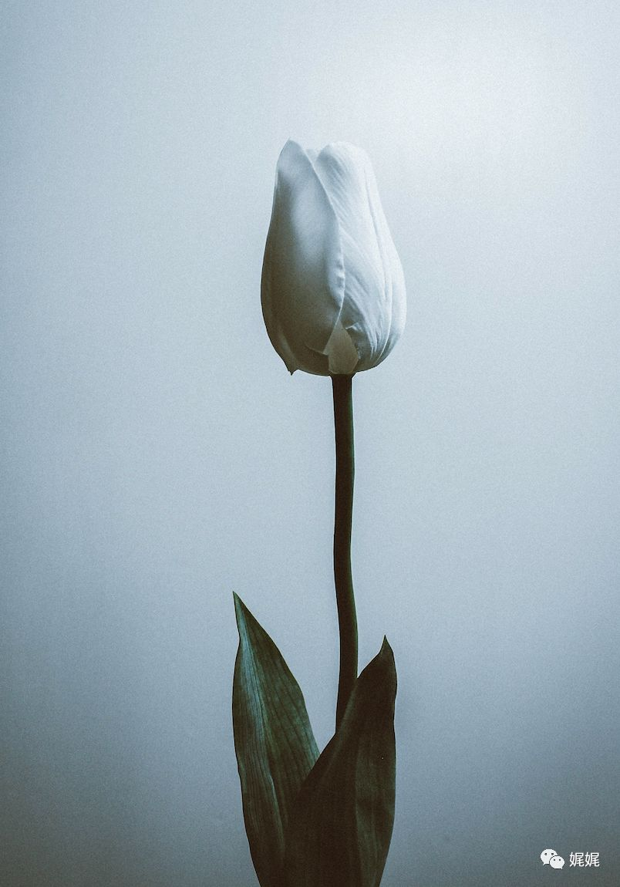

# 羊毛与花

穆羊坐在靠窗的位置上。面前的桌面上，摊放着打开的书本和笔记。阳光透过枝叶交错的缝隙，落在纸面上，形成斑驳的光影。风一吹，它们就在段落间跳动。

她歪头看向窗外，目光落在那些在风中被抖落的落叶上。纷飞的黄绿之间，她能看见一个身影朝自己走来，玫粉色的波浪在阳光下起伏，晃得她微微扯起了嘴角。

[羊毛与花](_media/羊毛与花.mp3  ':include')

### **「01」3/17 春**

穆羊是17年初来的上海。

普普通通的本科毕业生，工科专业，没什么特长。因此，求职的那段时间格外艰辛。12月份的时候，她才从相熟的朋友那里找到了一份写稿的工作。

第一份工资入账的时候，穆羊正在看房子。看中的是一间老宅的阁楼，15平米的样子，层高不足2米。虽然宅子老旧，但是阁楼是屋主重新装修过的。倾斜的屋顶上镶了一扇双开的小窗。穆羊读着银行的短信，阳光就从窗户外照进来，跳跃在屏幕上。

隔天，大包小包和气喘吁吁的穆羊，站在了这个小空间的正中央。穆羊喜欢这个小空间，只需要一扇小窗，让进来的阳光就足以把房间填满。伴随着呼吸，穆羊能看见那些沾染上阳光后，在空中漂浮、游动的毛絮。

### **「02」1/18 冬**

“沪漂”并不是件容易的事情。穆羊供职的单位是上海一家名不见经传的杂志社。互联网的发展让传统的纸媒得以电子化，不再需要完全依附于实体印刷物。这让很多新生的媒体平台在这一两年不断涌现，稳定发展。穆羊所在的工作室，员工不多，加上她只有6个人。因此，为了能够确保品牌月刊的稳定销量，穆羊每天都很忙碌。

然而，马不停蹄的日子里的穆羊就像被连着狠抽了几鞭的陀螺。转的飞快，也转的麻木。

18年的1月，穆羊经手的1月刊正式发售了。封面是本市小有名气的皮具艺人，是个高瘦的男人，头发微乱，下巴有微绻的胡渣。拍照的那天，男人穿了一件鹅黄色的衬衣，围着磨的泛白的皮围裙。穆羊端着相机，站在角落的阴影里拍他，男人站在工作台前，对着暖黄的灯光裁剪皮料。穆羊透过取景框，看锃亮的金属刀具在棕橘色的皮面上来回比划。男人动作熟练，干净利落。

那次的采访，穆羊做的格外认真。男人全程都在把玩一块废弃的皮料，摩挲久了的皮面有些发亮。

“那块皮料能给我吗？”临走的时候，穆羊小声问男人。

“可以啊，要拿来做什么吗？”男人声音中透着笑意。

“我想……我想拿来做书签。”穆羊咬咬唇，结巴道。

对面停顿了一会。男人转身走回到工作台前，拿起工具熟练的把皮料的毛边修建干净，打磨光滑。然后，用打孔器在皮料的一端，戳出一个圆孔，用一条黑色的皮绳穿过去，打上一个小巧的结。

男人拿着打理好的小礼物，走回到穆羊面前，说：“有空可以来我这里，我教你做书签。”

穆羊抬起头，惊讶的目光撞上男人浅浅的笑和瞳仁里那个脸红的自己。

### **「03」4/18 春**

喜花推门进来的时候，店铺里没什么人。看不见老板，也看不见客人。

喜花磨磨蹭蹭的脱掉外套，摘掉帽子。玫粉色的波浪卷儿倾泻而下，披散在她肩上。她嚼着泡泡糖，压低了眉毛，瞥了瞥角落的工作台，然后倏的愣住了。

工作台那儿站着一个人，背对着她。看衣着，应该是个女孩子。女生有一头蓬松的卷发，弓着背正非常吃力的摆弄着什么。

喜花蹙了眉，正要上前询问。右边却传来了一道熟悉的声音。

“喜花，来啦？”喜花偏头，看向朝自己走过来的老板。然后跟着老板走到穆羊身边，伸手打了招呼。

穆羊微胖的双颊上浮上两片红，憨憨的笑，手里握着一片皮料和打孔器。

“你好，我是穆羊。”

“哦，嗨，我叫喜花。”

### **「04」7/18 夏**

穆羊觉得，喜花很耀眼。高挑的身形，丰腴的胸脯、修长的双腿，爱穿厚重的上衣和紧身的牛仔裤，搭配磨到泛白的马丁靴。喜花总是咂巴着嘴，嚼着口香糖，声音很大，惹人侧目。然而，在穆羊眼里的喜花像一团燃烧到撩人的花簇，每一片花瓣都毫无章法又似有规律的相互层叠、跋扈伸展，拥着那一团不见天日、脆弱娇嫩的蕊。

相熟的日子里，穆羊喜欢去皮具店做东西，花上4、5个月磨制一块色彩特别的皮料，制作成一枚形状独一无二的书签。然后，用每次新做的书签，来读那些从喜花那拿来的读本和杂志。

模样喜欢那个背影挺拔的男人，喜欢他一尘不染的白衬衫，喜欢瞄他下巴上留着的胡茬儿和微皱的眉心。每次穆羊看着男人出神，喜花就会砸吧着口香糖走过，轻浮的“吁”出一声口哨。然后，男人转身，穆羊低头，喜花晃着身绕开。

### **「05」12/18 冬**

 

“喜花，我要去北京了。”

男人伸手夺走了喜花举在嘴边的烟，兀自的抽起来。喜花歪了歪身子，从兜里取出烟盒，熟练的抖出一根点上。

“我去北京后，你要不要把店铺接下来。”喜花最后一口烟吸完，把烟在地上碾了碾。她站起来，向男人的方向伸了手。

“这是钥匙，皮料和工具的进货点，你也都熟悉。”男人也站起来，走远的时候丢下了这句话。

于是，12月初雪的时候，男人离开了。

穆羊依旧会在每个周末来到店里，喜花仍旧会砸吧着嘴和她谈笑。穆羊不再沉默的自处，时常会帮喜花招呼来访的客人。喜花戒掉了香烟，也开始用店里的余料做起了书签。在穆羊眼里，喜花仍旧很耀眼，玫粉色的大卷换成墨黑色的直发，仍旧喜欢穿宽松的上衣和紧身的牛仔裤，配一双漆亮的马丁靴。而穆羊，则会在每个日落的傍晚，在店铺的角落里打着电话。目光在追着喜花的背影时变得柔软。

在这座城市进入深冬之前，穆羊和喜花都找到了生活最让人深爱的模样。

