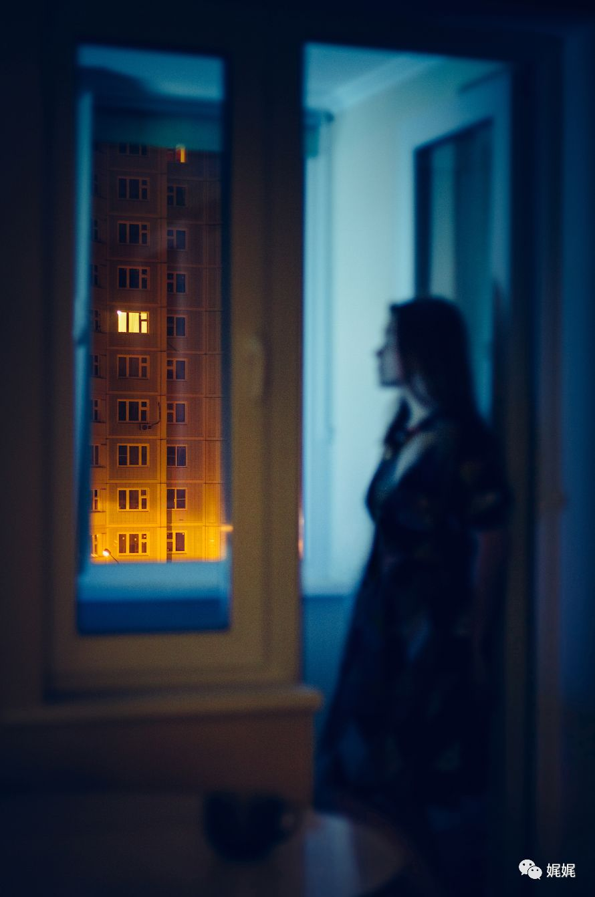
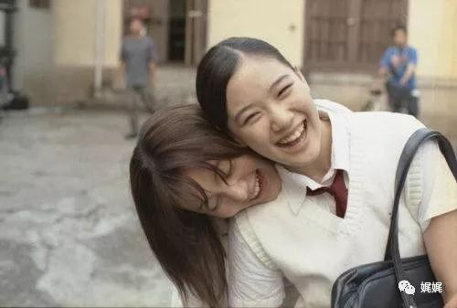

# 落红无声，已入秋：总要有些东西，在温暖渐远的时候来弥补。

“很多人说生活没那么简单。可是生活本就是一餐一饭，一生专心做好一件事。守着亲人留下的宅院，缝缝补补，在四季风物的更替里缓缓前进的。”

——《海街日记》

本期清单

《和歌子酒》

《海鸥食堂》

《面包与汤与猫咪好天气》

《美食祈祷和恋爱》

《花与爱丽丝》

《海街日记》

**「入秋必备」笑着悲伤，是最适合秋天的心情**

------

Sunday 0:00 am.

思量很久，觉得需要有一种形式的记录，记录下过往也留下些痕迹。

所以，在夏末秋初，我整理了适合配咖啡和糕点的电影。

愿你能选一段空置的时间，抱着抽纸，享受一个无关晴雨的下午。

### ***1.***

### ***《和歌子酒》***

无意间，发现了这部动画及真人版。

主角是个独自在生活的上班族，和城市里每个奔波忙碌却又时而茫然的年轻人一样，和歌子每天都在经历生活和工作给予她的喜悲。面对琐碎，无论是欢喜还是烦恼，她都有办法来迎接或化解。

最好的“解忧良药”就是美味的酒品和偶遇的美食啦。

所以，在工作和生活之间划出一条分割线，用美酒佳肴来唤醒自己吧！

*和歌子 \*pic from internet\* | 动画版*

*喝到超赞的酒品时，忍不住发出“pu～～～”，满足感溢出*

*
*

很多漫画或动画作品都有真人版，但是改编质量及选角水平都参差不齐。值得庆幸的是，和《孤独的美食家》一样，《和歌子酒》的改编还蛮不错的（至少个人这么认为）。虽然真人版的女主角没有动画版本那么可爱、灵动，但是“真材实料”的美食可谓是让人大饱眼福了。

> 和歌子 | 真人版
>
> 就连超满足的“pu～～～～”都100%还原了。只是主角前身是运动员，果然吃不胖是最大的福气呀～

最可爱的地方是，和《孤独的美食家》一样，《和歌子酒》里的店铺大多都是真实存在的。好心的网友还有整理成集，感兴趣的小伙伴可以找去试试哦。

> 网友整理http://www.sohu.com/a/17540685_188369

### ***2.***

### ***《海鸥食堂》***

这是一部会让人“犯困”的电影。没有太多的剧情起伏，没有尖锐的矛盾冲突，甚至没有精彩的人物关系。

然而，这个故事的主角似乎就自然而然的由人变成了这样一处“地方”。海鸥食堂，打开门将每个寻来的人都迎进来，让他们被温暖和治愈。当他们获得力量后，便能带着微笑与温暖走出门去，重新回归自己的生活。

海鸥食堂，又像一只海螺。每个人走近它，对它诉说。而它，静静的躺着，装载进每个人的故事。这些故事，顺着潮起潮落的海水，被带入大海，永远留下。

> 《海鸥食堂》

这是一间食堂，而非餐厅。这样的定义，似乎一下子把焦点聚集在了食客身上（而非菜品），来来往往、熙熙攘攘，人们来了又去。这些经过这里，驻足又离开的人们，带着故事来享用美食，留下故事又带走了微笑。*

无论是节奏还是色调，都很“日式”。每一秒钟都不会让你兴奋，但每一秒钟你都不想错过。这样漫长的观影时光，配一壶调制香醇的奶茶，一下午的时光都被染的醇香。

### ***3.***

### ***《面包与汤与猫咪好天气》***

惊喜，此片与《海鸥食堂》主角交集好多。不过，相比于海鸥食堂，这一部有一些接地气的剧情和好理解的人物背景（But，人物关系还是让人不可寻）。

女主的母亲意外离世。生活的变故和公司的人事调动让她开始思考人生的同时，也决定辞去朝九晚五的编辑工作，接手母亲生前经营的食堂。

和海鸥食堂类似，这个只提供面包和汤的食堂依旧装载着各色食客的故事。只是本次的背景从海外芬兰移回到日本本土，被安扎在居民区的小食堂显得更加温馨。

电影中，食堂的左领右舍、女主学生时期的老师、对手饭店的老板已经新招的店员，这些频繁交错的人物让这一部显得更加家常、欢快。

> 《面包与汤与猫咪好天气》

*“做我最擅长的事情”是女主一直跟自己说的话。然而，我们的很多苦恼都是来自于那些“不擅长的事情”。*

### ***4.***

### ***《美食、祈祷和恋爱》***

> 《美食、祈祷与恋爱》
>
> 我得承认，整部电影最让我怦然心动的是罗伯茨在意大利租房子那段。欧式挑高的层高，旧却复古的高窗被推开，阳光顺势洒进来。整个房间美到让人想尖叫，瞬间想去欧洲租房子……哈哈

有一种“世界辣么大，我想去看看”的赶脚。

在惊讶于朱莉亚罗伯茨美貌的同时，再次一领悟到“爱情离场总会让女人开始思考人生真谛”。可见，女人天生是水做的，而失去爱情的女人就像缺了水的鲜花（无论是失去对方，还是失去被爱的自己）。

女主离婚后，选择周游世界去参悟人生。从热情奔放的意大利到佛学历史深远的印度，女主用了1年时间在每一处目的地落脚，去尝试以最近的姿势贴近不同的文化。除了感受当地的美食与人文风光外，也接触了不同的爱情。

不同的男人、不同的身份，代表着不同的爱情。女主在虚幻与真实、理想与现实之间来回游走，最终在印度喜获了新的感情和伴侣。

> 《美食、祈祷与恋爱》
>
> 在现代都市之中，每个职业女性的内心都应该会憧憬至少一次的出走。我们不满足于“身在山中”的困窘，渴望在迷茫的时候走出去，看到自己世界真实的全貌。然而，走出去就意味着要和这个“融入骨血”的“熟悉感”分离，直面血肉破裂的疼痛与不安。

这样描述剧情，会让人有一种在看“后宫剧”的感觉。但是这的确不是一个女人周游世界，练级打怪，采花寻蜜的故事（瞬间想到好多日漫和小说，呵哈嘿）。电影的重点，是让观者放下主观想法，跟着主角去观其所观、惑其所惑、然其所然。

当你带着与主角类似的疑虑看下去，在电影的结尾，你或许能伴随着主角的微笑，找到属于你自己的答案。

###  ***5.***

### ***《花与爱丽丝》***

> 《花与爱丽丝杀人事件》
>
> 相比于真人版，我更偏爱动画版本的故事结构。大概是因为开头关于“杀人事件”的一个小悬念吧，这种舌尖上的辛辣才能带出回甘的魅力。虽然，动画版是真人版的后传。

也是在写推荐的时候，才回去查证了下两部作品的关系。04年的版本里，电影更偏向于青春片，少女之间友爱难分的感情、男女之间的情窦初开、青春期固有的烦恼与迷茫，以及成长带来的“亲情迷思”。而15年动画的版本里，大概是因为动画人物与真实人物之间的差别，作品染上了一丝“玄幻”和无厘头。

之所以，动画版本更受我偏爱，是因为它将少女们从琐碎生活固有的烦恼与无奈中“救”了出来，让她们投身于虚无的“冒险”中，并赋予她们一种揭秘的“使命感”。而这种看似胡闹的设定，却最能够支撑他们忘却现实中的那些“无能为力”，从而真正仰头迎接那束照进自己青春的阳光。

> 《花与爱丽丝》
>
> 少女总是最明媚世界的阳光，她们一笑，天就亮了。

电影中，少女之间无关情爱却也不似单纯友情的关系，像相互交握的双手。彼此用力，挤压中有疼痛却也有无尽的温暖。

早前那个“女生没有异性恋”的说法，虽然荒诞且无依据，但我却有些认同。这个世界、这个社会给了女性太多荆棘，不是刻意为难却也无奈是真。

因此，水流里会渐渐立起石块，来迎接那些激荡出的巨大水花。

### ***6.***

### ***《海街日记》***

> 《海街日记》
> 熟悉的日剧女演员都在这部剧里了。不过日影的色调总能让每个角色都很好的被作品分割开来，让我完全将演员固定在角色里。*

女性群像类的作品其实蛮多的，从《欲望都市》、《美少女的谎言》到《绝望的主妇》，等等这些都从不同侧面反应不同女性在不同环境下的展现出的不同魅力。由于其独有的社会属性和性别特征，女性角色的可变性总是很大。而又由于性别造就的敏感与细腻，让周遭的细微变化都能够在女性的身上得到程度相当的折射。

电影的主角是四个姐妹，由于父亲的离世而相聚。四个性感迥异的女孩带着属于各自的秘密与故事，聚集在父亲曾经生活过的房子里。大姐（绫濑遥饰）承担着如父如母的重担，举手投足间都散发一种家长的气息，责任与压力让她年轻的面庞上少有笑容。而三个妹妹在大姐的照顾下，得以保有属于自己年龄的那一份纯真和矛盾。

《海街日记》中，每个女生的造型都很完美的诠释了这个角色的性格特点。大姐发型朴实，中马尾既没有过分的活泼也没有过分的疏离，整个人显得单薄却又透着倔强。二姐的长发微卷，透着一股柔美与风情，所以拥有爱情的烦恼。三妹是活泼的丸子头，清瘦又苍白的外貌透着一股子初入俗世的迷茫，下意识的抿唇或无意识的露齿欢笑让她成了承接“姐姐”和“妹妹”之间角色转换的一环。小妹是乖巧的童花头，没心没肺的爱着三个姐姐，却又有少女独有的忧虑。

与其说是群像，不如说她们四人演绎出一个女子的成长曲线。小妹的加入，让原本最小的三妹变成了姐姐，这样一个细微的变故就促成了角色一瞬间的成长。就像一朵原本含苞的花骨朵，经历一次春风的拂面就悄然绽放一样，生命的妙不可言都在你旁观电影的过程中被精细刻画。

> 《海街日记》
>
> 有机会再推荐几部她其他的作品吧，《我的家中空无一物》、《粉与灰》等。

然而，生命就是这些甜涩参半、苦笑怒骂的集合。你也许时有厌烦，却仍旧选择继续坚持，等待阵痛过去。

“活着的东西都很费功夫的。”活着，无论什么时候，都要很用力才行。

